# Ympäristön pystytys

Ensin asennan MySQL/MariaDB osana XAMPPia ja käynnistän MySQL servicen:  

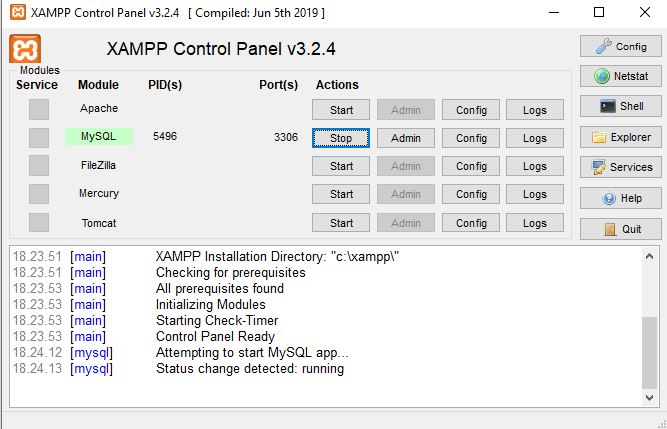  

Tämän jälkeen asennan MySQL workbench:  

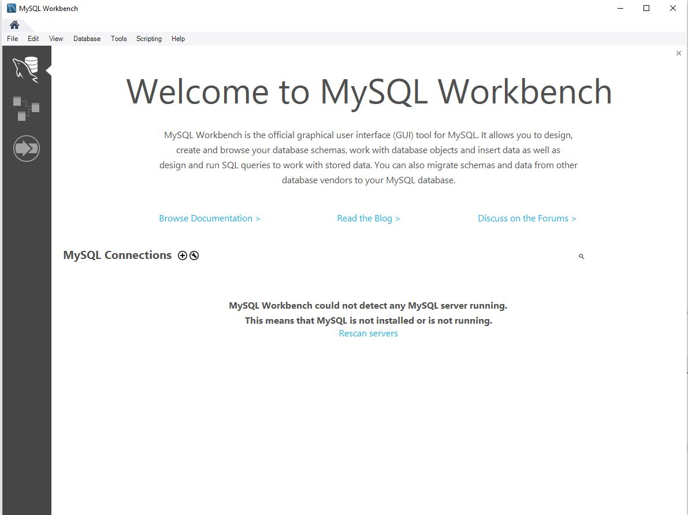  

Asennuksen jälkeen luon uuden yhteyhden painamalla pientä `+` näppäintä. Tähän tulee seuraavat tiedot:  

```
Connection Name: tietokannat_db
Hostname: 127.0.0.1
Port: 3306
Username: root (XAMPPin MySQLin oletuspääkäyttäjä)
Password: [Store in Vault] (Klikkaa tätä ja jätä salasanakenttä tyhjäksi, se on oletusarvo)
```  

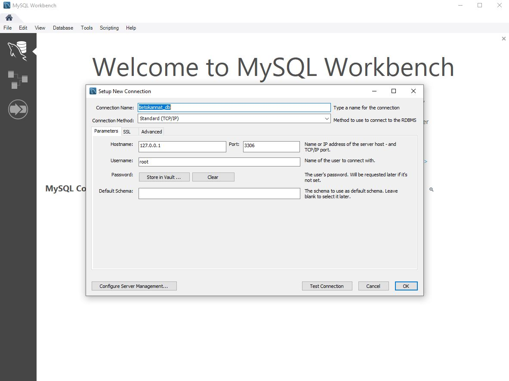  

Painan `OK` ja painan uutta yhteyttä joka on nyt luotu. Uudessa ikkunassa luon uuden databasen klikkaamalla punaisella merkittyä `create a new schema` -painiketta.  

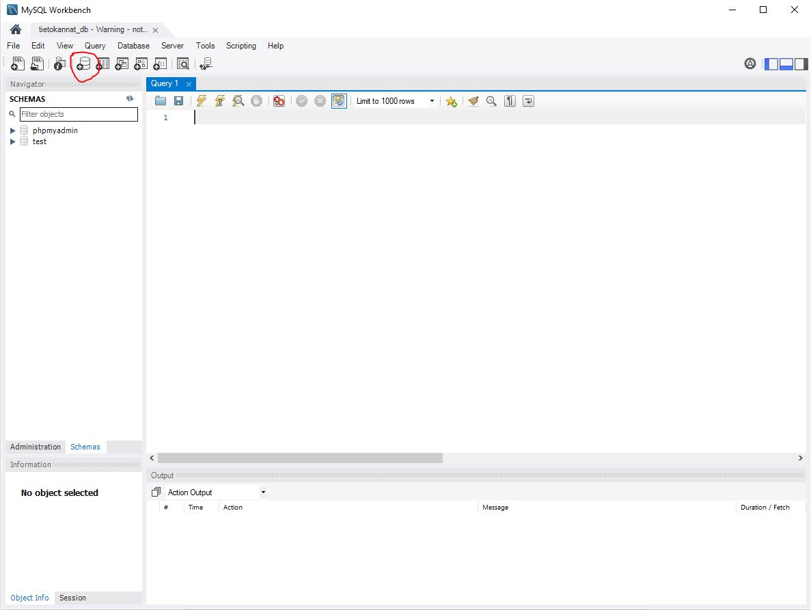  

Kirjoitan tietokannan nimeksi `student_db` ja painan apply/apply/finish  

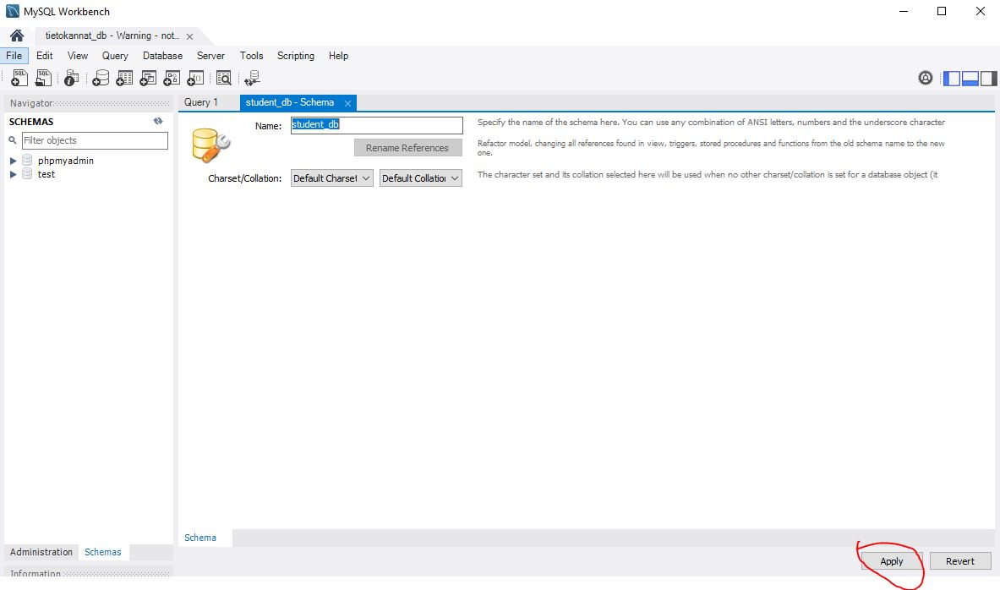  

Uusi tietokanta ilmestyi minun navigator-ikkunaan. Valitsen sen minun oletustietokannaksi painamalla hiiren kakkospainiketta ja valitsemalla `Set as Default Schema`.  

Nyt tämä tietokanta on lihavoitu ja kaikki toimintoni (Esim suorittamani SQL-lauseet) kohdistuvat oletusarvoisesti siihen.  

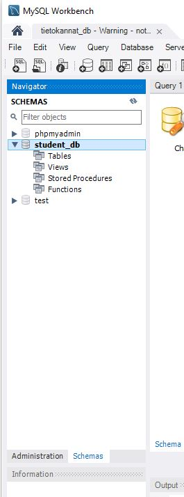  

Valitsen painikerivin vasemmanpuoleisen punaisella merkitty `Create a new SQL tab for executing queries` -painiketta avatakseni SQL-tabin jotta voin suorittaa SQL-lauseita.  
Lisään opintojaksolla käytettävän esimerkkitietokannan kopioimalla sen SQL-tabiin ja suorittamalla kaikki SQL-lauseet punaisella merkityllä `salama` -painikkeella:  

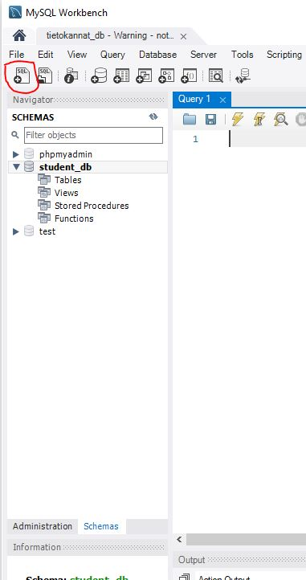  
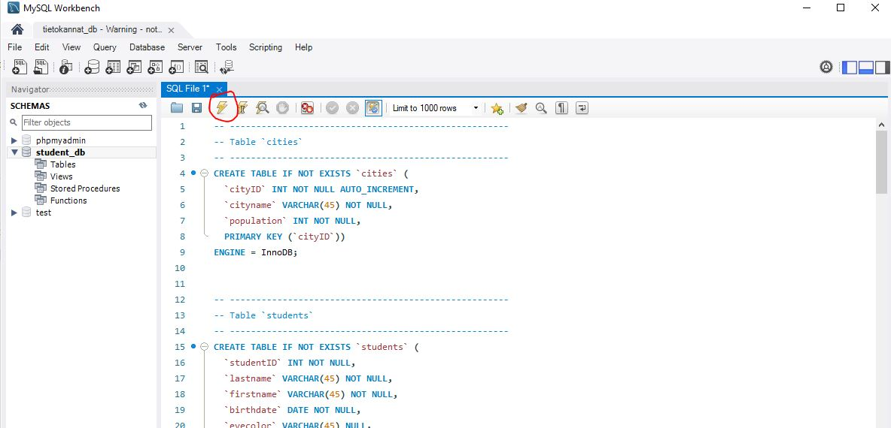  

Tämän jälkeen näen, että lauseiden suoritus onnistui:  

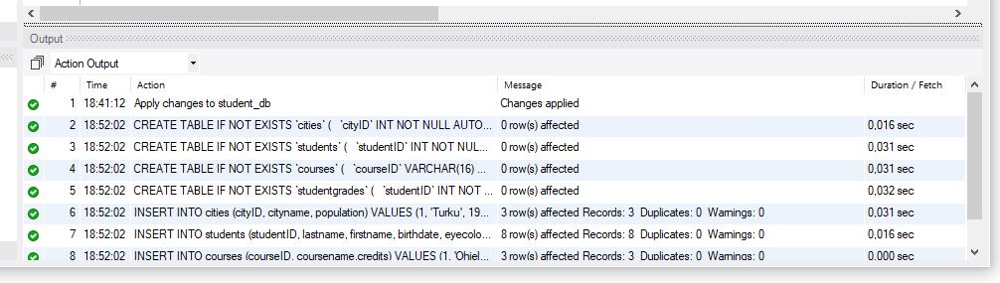  

Nähdäkseni lisätyn sisällön valitsen oheisen kuvan mukaisesti esimerkiksi `cities` -taulu hiiren kakkospainikkeella ja valitsen `Select all rows`:  

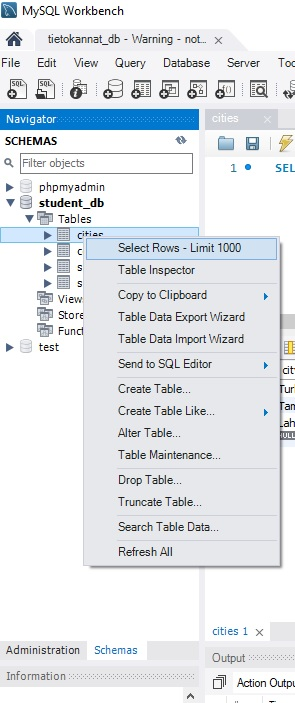  

**HUOM!** Aiheuttamat muutokset eivät aina näy reaaliaikaisesti Worbenchin eri ikkunoissa. Klikkaa haluttua objektia (esim Tables) hiiren kakkospainikkeella ja valitse `Refresh All` nähdäksesi ajantaisen sisällön.  

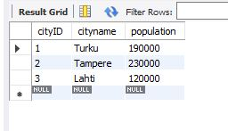  

Tästä näen, että olen luonut esimerkkitietokannan onnistuneesti!  

### SQL-kyselyjen suorittaminen Workbenchissä

Tämä osio ei ole osa harjoitusta, vaan henkilökohtainen muistio liittyen SQL-kyselyjen suorittamiseen. Tehtävä 2 on alempana.  

Yleisimminkin SQL-kyselyjä suoritetaan Workbenchissä täsmälleen samoin kuin edellä kohdassa uuden tietokannan luominen.  
Kyselyjä suoritetaan seuraavasti:  

1. Valitse haluamasi tietokanta oletustietokannaksi valitsemalla se hiiren kakkospainikkeella `Set as Default Schema`. Tällöin valitsemasi tietokanta näkyy lihavoituna ja kaikki toimintosi (esim. suorittamasi SQL-lauseet) kohdistuvat oletusarvoisesti siihen.  
2. Valitse painikerivin vasemmanpuoleisen ohessa keltaisella merkitty `Create a new SQL tab for executing queries` -painike avataksesi SQL-tabin suorittaaksesi SQL-lauseita.  
3. Kirjoita haluamasi SQL-kysely ikkunaan ja klikkaa vihreäksi merkittyä `salama` -painiketta suorittaaksesi kyselyn.  
4. Tulokset ilmestyvät ikkunaan alle. Tulosjoukon voit halutessasi tallentaa tekstimuodossa.

## Harjoitus 1 - Tehtävä 2

Liityn *Labranet*:iin VPN -yhteydellä ja luon uuden tietokannan osoitteessa `https://mariadb.labranet.jamk.fi/`:  

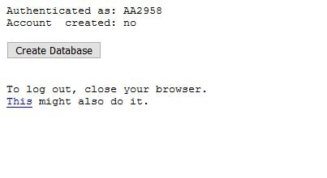  

Tämän jälkeen avaan Workbench -ohjelman ja luon uuden yhteyden tähän uuteen tietokantaan. Asetukset ovat:  

```
Connection Name: Labranet_mariadb
Hostname: mariadb.labranet.jamk.fi
Port: 3306
Username: N1234 (Sinun oma opiskelijatunnus)
Password: [Store in Vault] (Klikkaa tätä ja syötä kohdassa 1 generoitu salasana tähän)
```  

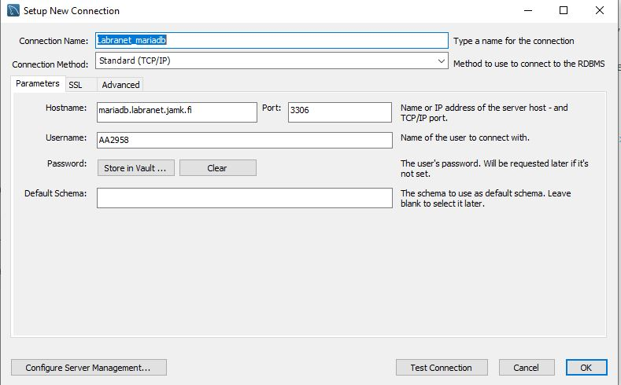  

**HUOM!** Labranetin MariaDB-järjestelmään voit luoda vain neljä ennalta nimeltään ennalta määrättyä tietokantaa. Jos labraverkon käyttäjätunnuksesi on N1234, niin voit luoda ja poistaa seuraavan nimisiä tietokantoja:  

```
N1234
N1234_1
N1234_2
N1234_3
```  

Tässä tapauksessa tietokannan nimeksi tulee `AA2958`.  

Luon uuden esimerkkitietokannan kuten *Tehtävä 1*:ssä.  

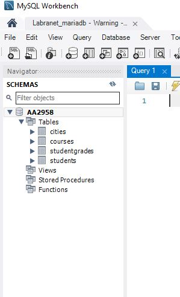  

Tämän jälkeen suoritan seuraavat SQL -kyselyt:  

```
SELECT * FROM students;
SELECT * FROM courses;
```  

Tuloksena on:  

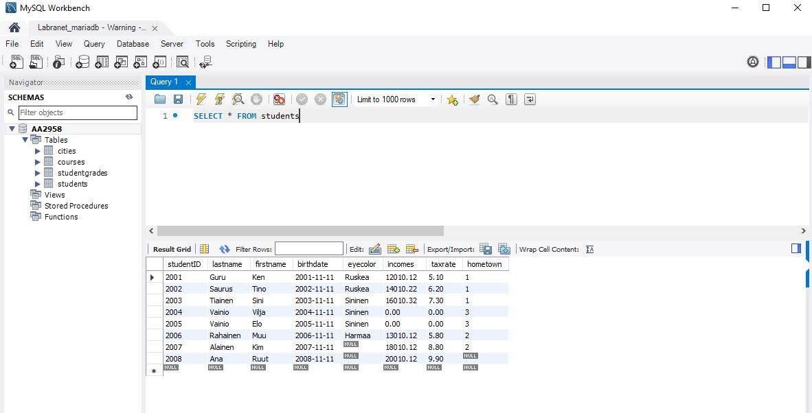  
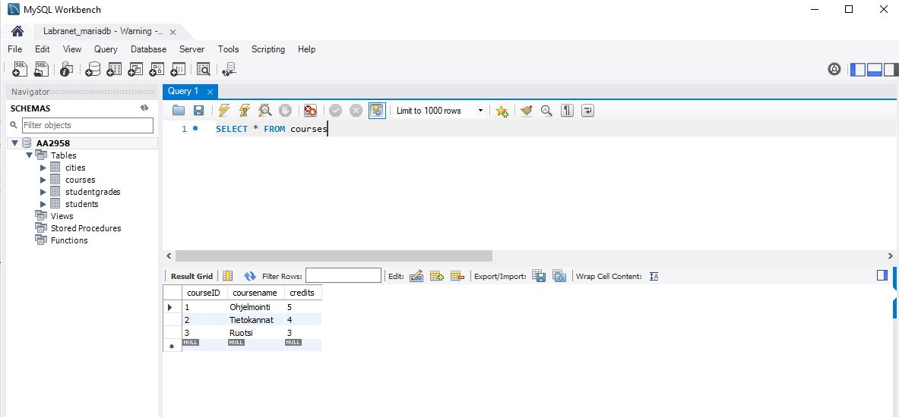  

Näyttää siltä, että minun SQL -kyselyni onnistui!


