# SQL-perusteet

Aloitan luomalla yhteyden minun henkilökohtaiseen MariaDB palvelimeen joka on JAMKissa.

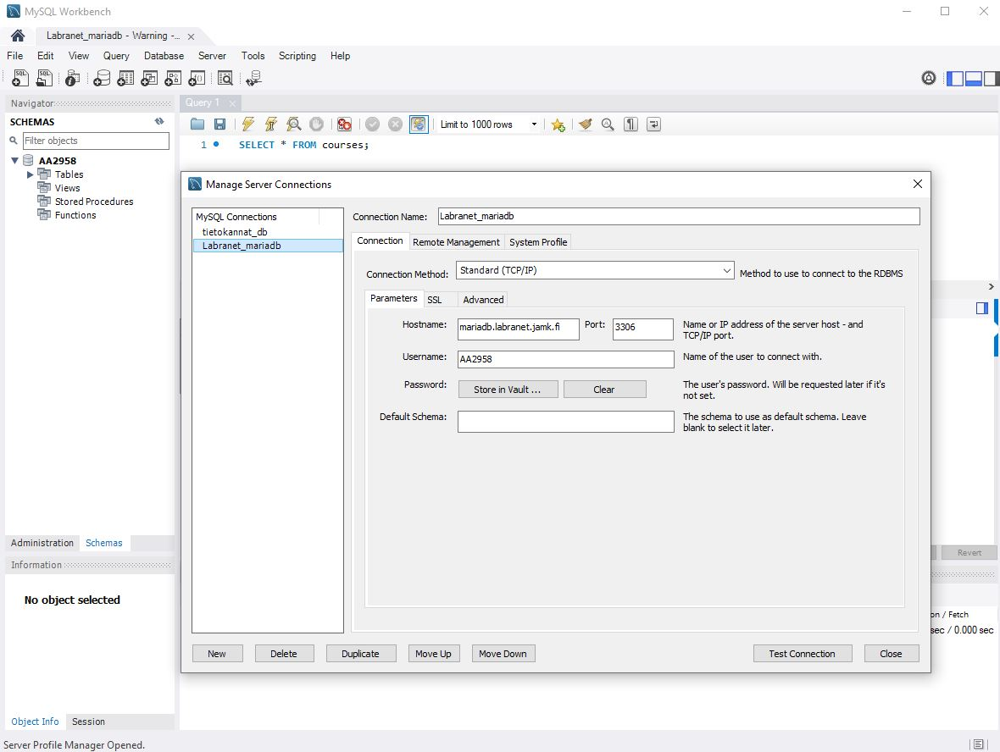  

Tehtävänä on saada  
A) Kaikki kaupungit (cities) kaikki sarakkeet näkyviin.  

Tämän voi suorittaa SQL-kyselyllä  
```
SELECT * FROM cities
```  
Tästä tulee tulos:  

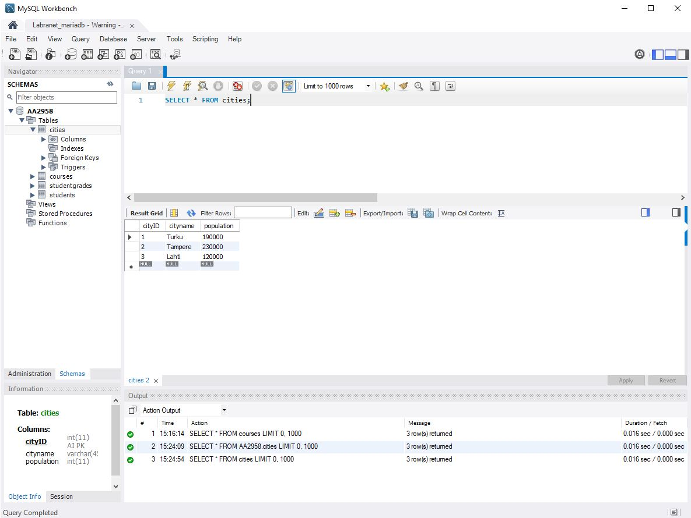  

B) Hae kaikkien kaupunkien nimet ja asukasluvut. Lajittele asukasmäärän mukaan pienimmästä suurimpaan.  
Tämän voi suorittaa seuraavalla kyselyllä:  
```
SELECT cityname, population FROM cities ORDER BY population
```  
Tulos näyttää tältä:  

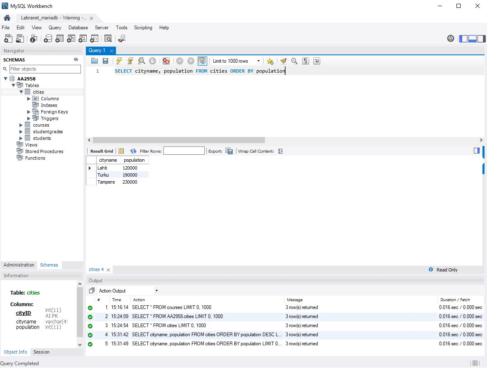  

C) Mitä eri silmien värejä opiskelijoilla on? Kukin väri saa tulostua vain kerran ja tulosjoukossa saa olla vain yksi sarake.  

Tämän voi tehdä esimerkiksi seuraavalla kyselyllä:  

```
SELECT DISTINCT eyecolor FROM students
```  

Tulos näyttää tältä:  

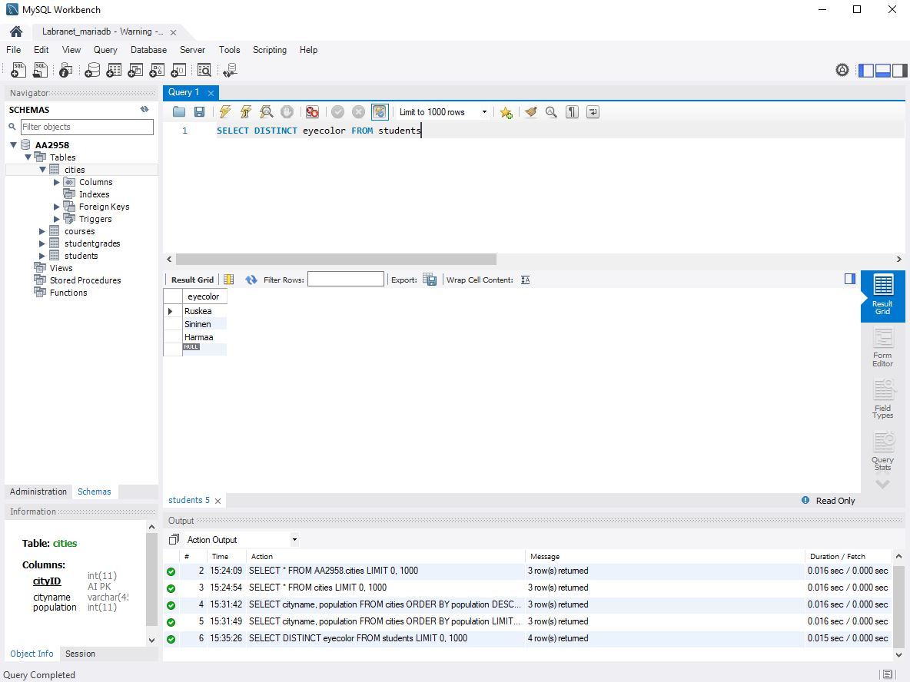  

D) Hae opiskelijoiden suku- ja etunimet, silmien väri ja tulot (incomes): incomes-sarakkeen otsikoksi pitää tulla Vuosipalkka.  

Tämän voi suorittaa kyselyllä:  

```
SELECT firstname, lastname, eyecolor, incomes AS 'Vuosipalkka' FROM students;
```  
Tulos näyttää tältä:  

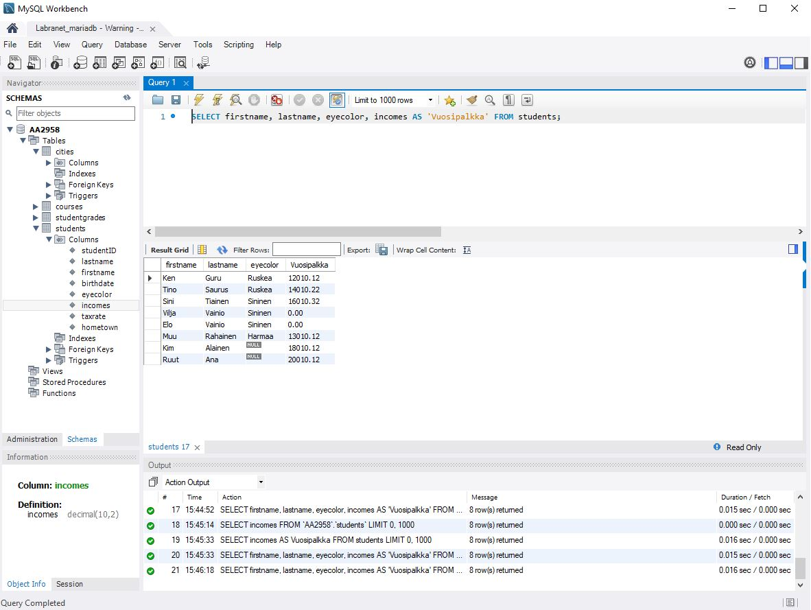  

E) Lajittele edellinen tehtävä ensijaisesti suku ja toissijaisesti etunimen mukaan kummatkin laskevassa järjestyksessä (käänteinen aakkosjärjestys).  

Tämä voidaan suorittaa kyselyllä:  

```
SELECT firstname, lastname, eyecolor, incomes AS 'Vuosipalkka' FROM students ORDER BY lastname DESC, firstname DESC;
```  

Tulos näyttää tältä:  

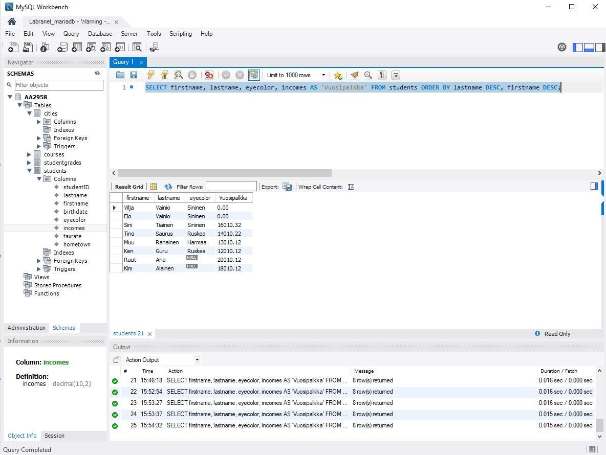  

## Harjoitus 2 - Tehtävä 2

Aloitan yhdistämällä minun paikalliseen tietokantaan komentoriviltä:  

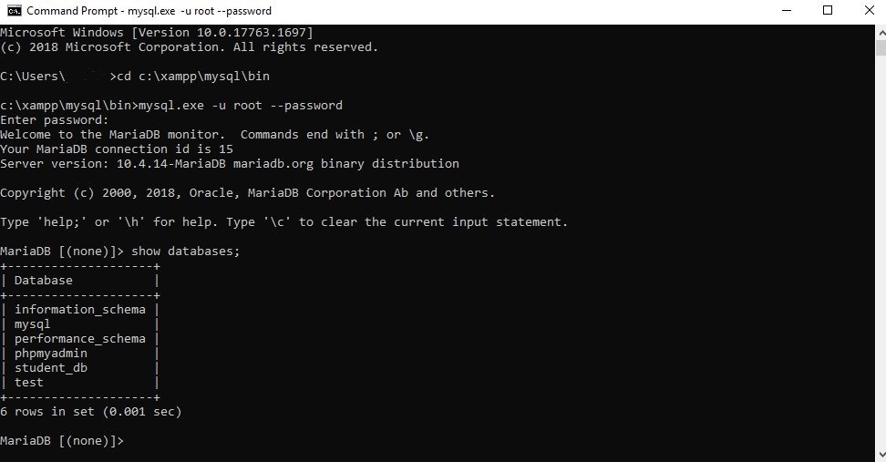  

A) Hae niiden opiskelijoiden suku- ja etunimet, joiden silmien väri on 'Sininen'.  

Komentona käy tähän esimerkiksi:  

```
SELECT firstname, lastname FROM students WHERE eyecolor = 'Sininen';
```  

Tältä näyttää tulos:  

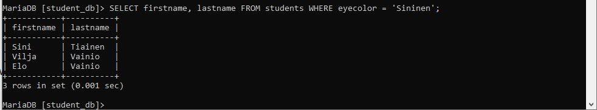  

B) Listaa ne opiskelijat, joilla on pienemmät tulot kuin 14010.22? Hae nimet ja tulot.  

Tähän käy komento:  

```
SELECT firstname, lastname, incomes FROM students WHERE incomes < 14010.22;
```  

Tältä näyttää tulos:  

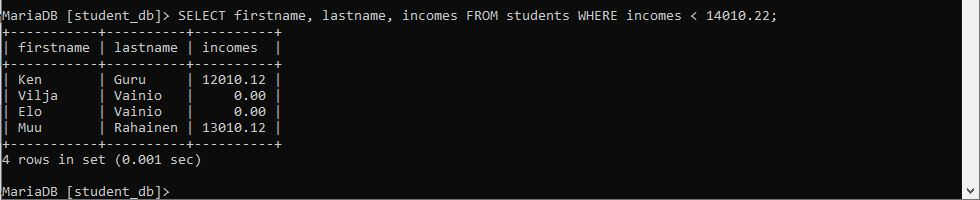  

C) Listaa ne opiskelijat, joilla on pienemmät tai yhtäsuuret tulot kuin 14010.22? Hae nimet ja tulot. Lajittele palkan mukaan laskevasti.  

Tämän voi tehdä muuttamalla edellistä komentoa hieman:  
```
SELECT firstname, lastname, incomes FROM students WHERE incomes <= 14010.22 ORDER BY incomes DESC;
```  

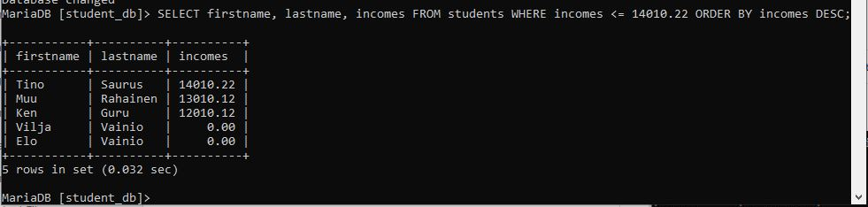  

D)  Hae ne turkulaiset (hometown = 1) opiskelijat, joiden silmien väri on Sininen. Tulosta sarakkeet `studentID`, `lastname`, `firstname`, `eyecolor` ja `hometown` (kokonaisluku).

Tämän voi tehdä komennolla:  
```
SELECT hometown, studentID, firstname, lastname, eyecolor FROM students WHERE eyecolor = 'Sininen' AND hometown = '1';
```  

Tältä näyttää tulos:  

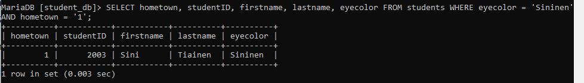  

E) Listaa kaikki turkulaiset opiskelijat ja heidän lisäksi kaikki silmien väriltään harmaat. Tulosta kaikki sarakkeet.  

Tämän voi tehdä komennolla:  

```
SELECT firstname, lastname, hometown, eyecolor FROM students WHERE eyecolor = 'Harmaa' AND hometown = '1';
```  

Tältä näyttää tulos:  

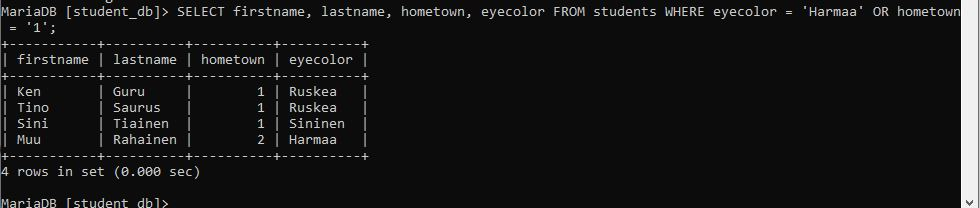  

## Harjoitus 2 - Tehtävä 3

Aloitan asentamalla HeidiSQL:n portable version koneelleni ja käynnistämällä HS:n session managerin:  

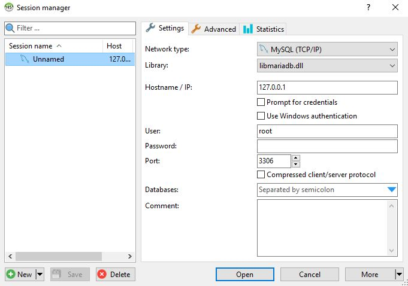  

Tämän jälkeen luon yhteyden minun tietokantaan.  

A) Hae kaikki sarakkeet opiskelijoista, joiden veroprosentti (taxrate) ei ole 0.00  

Tämän voi tehdä komennolla:  

```
SELECT * FROM students WHERE taxrate != '0.00';
```  
Tästä tulee tulos:  

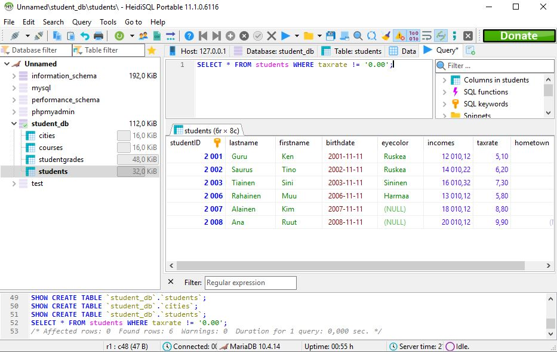  

B) Hae turkulaisista tai tamperelaisista opiskelijoista ne, joiden tulot ovat yli 14000.  

Tämän voi tehdä komennolla:  
```
SELECT * FROM students WHERE hometown = '1' OR hometown = '2' AND incomes > 14000;
```  

Tästä tulee tulos:  

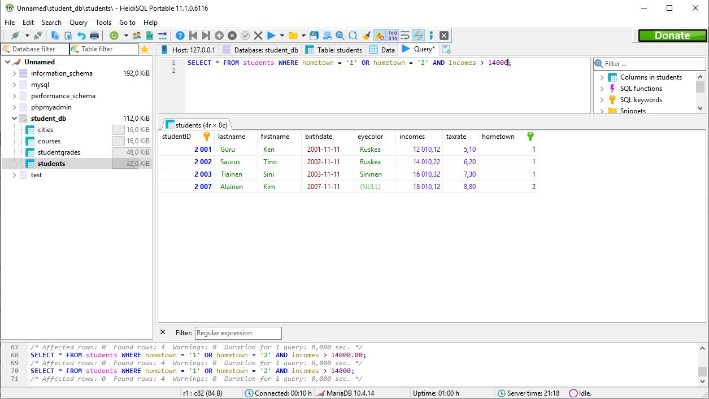  

C) Hae opiskelijat, joiden veroprosentti on 0.00, 6.20 tai 7.30 (käytä IN-määrettä)  

Tämän voi tehdä komennolla:  
```
SELECT * FROM students WHERE taxrate IN (0.00, 6.20, 7.30);
```  

Tästä tulee tulos:  

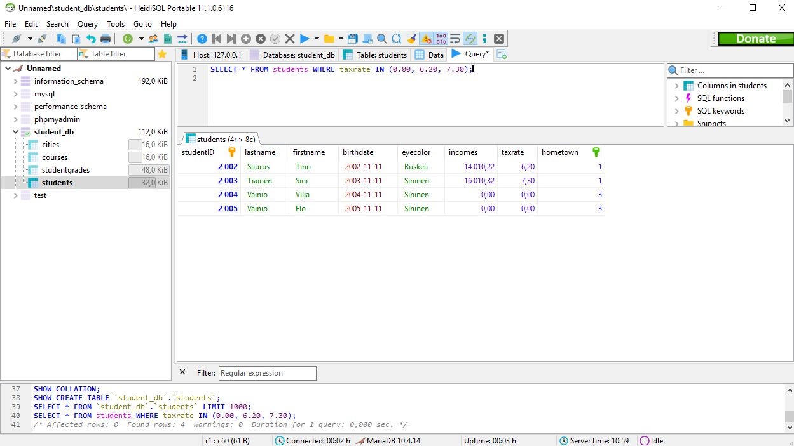  

D) Hae opiskelijat, joiden kotikunta ei ole tiedossa (on NULL)  

Tämän voi suorittaa komennolla:  
```
SELECT * FROM students WHERE hometown IS NULL;
```  

Tästä tulee tulos:  

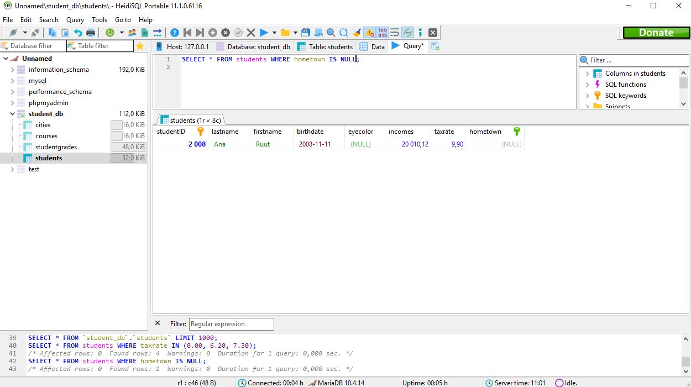  

E) Hae opiskelijat, joiden silmien värin EI tiedetä olevan 'Sininen'.  

Tämän voi tehdä komennolla:  
```
SELECT * FROM students WHERE eyecolor != 'Sininen';
```  

Tästä syntyy tulos:  

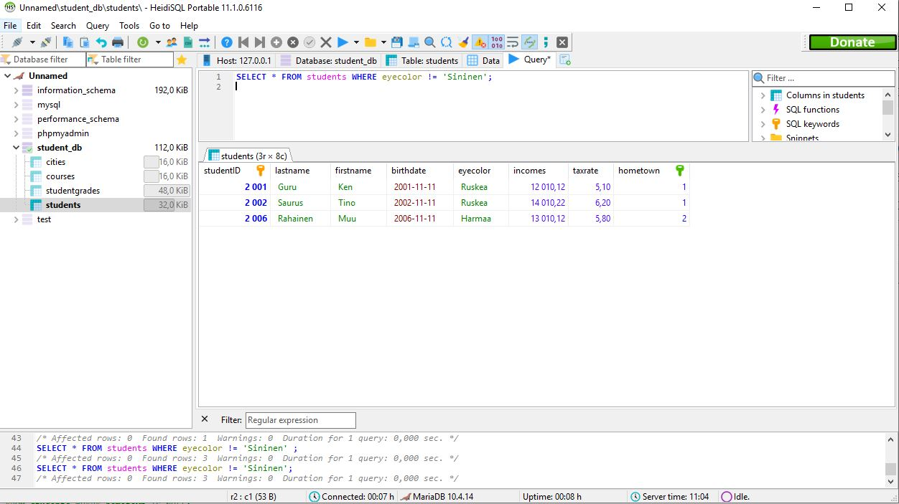  

## Harjoitus 2 - Tehtävä 4

Suoritan tämän tehtävän DBeaverilla. DBeaver on "Multiplatform database tool" joka tukee useita tietokantoja, mukaanlukien MariaDB:tä. Community edition on ilmainen ja open-source, joten käytän tätä versiota.  

Käynnistän DBeaverin ja luon yhteyden minun tietokantaan:  

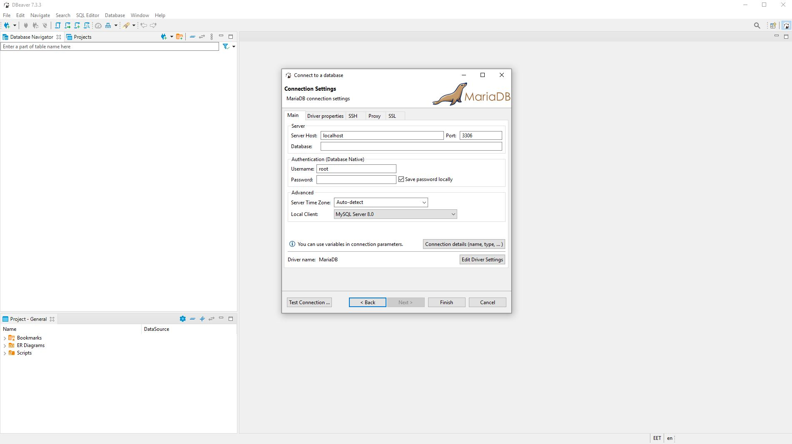  

Tämän jälkeen asetan student_db:n oletus tietokannaksi.  

A) Hae kaikki kaupungit (cities); kaikki sarakkeet näkyviin  

Tämän voi tehdä komennolla:  
```
SELECT * FROM cities;
```  

Tästä syntyy tulos:  

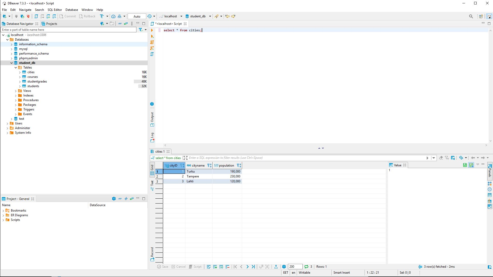  

B) Hae kaikkien kaupunkien nimet ja asukasluvut. Lajittele asukasmäärän mukaan pienimmästä suurimpaan.  

Tämän voi tehdä komennolla:  
```
SELECT cityname, population FROM cities ORDER BY population;
```

Tästä syntyy tulos:  

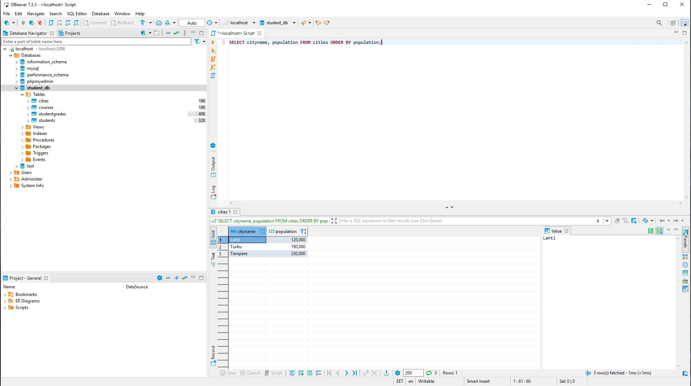  

C) Mitä eri silmien värejä opiskelijoilla on? Kukin väri saa tulostua vain kerran ja tulosjoukossa saa olla vain yksi sarake.  

Tämän voi tehdä komennolla:
```
SELECT DISTINCT eyecolor FROM students;
```

Tästä tulee tulos:  

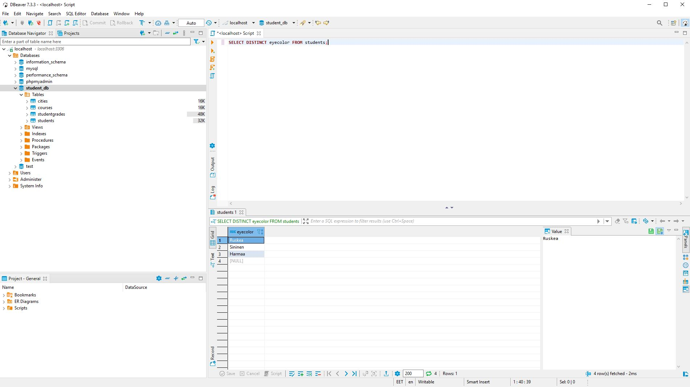  

D) Hae opiskelijoiden suku- ja etunimet, silmien väri ja tulot (incomes): incomes-sarakkeen otsikoksi pitää tulla Vuosipalkka.  


Tämän voi suorittaa komennolla:  
```
SELECT firstname, lastname, eyecolor, incomes AS 'Vuosipalkka' FROM students;
```

Tästä syntyy tulos:  

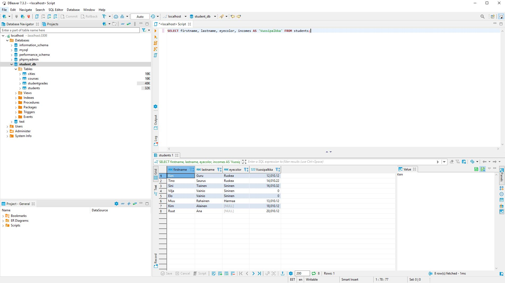  

E) Lajittele edellinen tehtävä ensijaisesti suku ja toissijaisesti etunimen mukaan kummatkin laskevassa järjestyksessä (käänteinen aakkosjärjestys)

Tämän voi suorittaa komennolla:  
```
SELECT firstname, lastname, eyecolor, incomes AS 'Vuosipalkka' FROM students ORDER BY lastname DESC, firstname DESC;
```

Tästä syntyy tulos:  

  

## Harjoitus 2 - Tehtävä 5

Vertaile ytimekkäästi (2-5 virkettä) mysql-, MySQL Workbench- ja HeidiSQL-ohjelmien ensikäyttökokemuksia ja soveltuvuutta eri käyttötarpeisiin. 

MySQL Workbench on tyylikkäin ja helpoiten osattava ohjelma. Siinä on intuitiivinen UI joka helpottaa ensikertalaisen kokemusta. HeidiSQL on ilmainen, open-source ohjelma jossa on kattava valikoima työkaluja. Ongelmana on hieman sekainen UI jossa on paljon erinvärisiä nappeja ja lahjoituspyyntöjä. DBeaver tukee hyvin monia eri tietokantoja ja siinä on useita valmiita teemoja joka on hieno lisäys. MySQL komentolinjalta oli kaikista yksinkertaisin ja "lightweight" -ratkaisu joka on jossain tapauksissa suotavaa.  

Kaikki mainitut ratkaisut tukevat etäyhteyksiä ainakin jollain tavalla. Jos minun pitäisi tehdä yksinkertaisia muutoksia tai tarkistaa jotain nopeasti, niin tekisin sen mieluiten komentolinjalta. Isommat operaatiot tekisin mieluiten edellämainituilla ohjelmilla.


