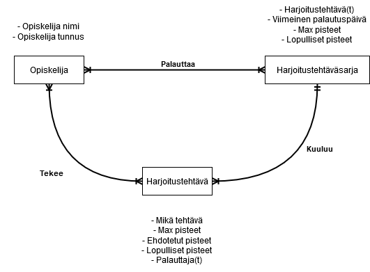
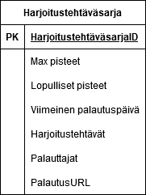
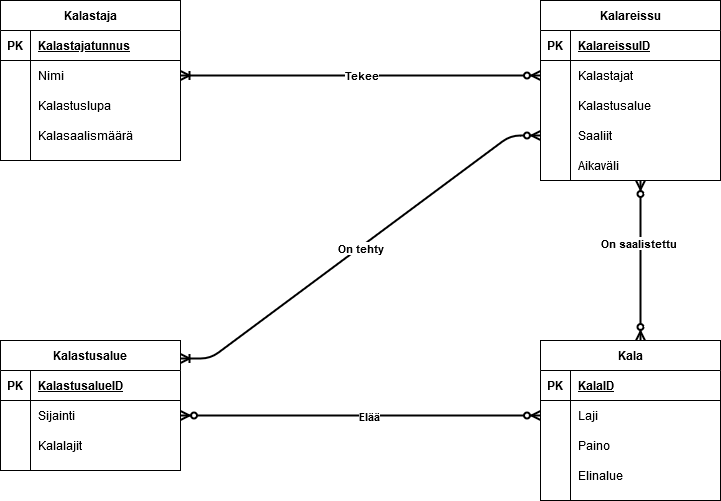

# Tietokantojen suunnittelu

## Harjoitus 3 - Tehtävä 1

>Suunnittele tietokantaratkaisu tämän opintojakson harjoitustehtävien palauttamiselle tarkoitetulle ScoreTronic-palvelulle. Opiskelijat palauttavat viikottain harjoitustehtäväsarjaan kuuluvat tehtävänsä.  
>
>Harjoitustehtäväsarja koostuu useista harjoitustehtävästä. Tietty harjoitustehtävä voi kuulua *VAIN* yhteen harjoitustehtäväsarjaan. Yksittäisellä harjoitustehtävällä on määritelty maksimipisteet. Opiskelija tekee jokaiselle tehtävälleen piste-ehdotuksen ja opettaja lopulta päättää pisteet.  
>
>Opiskelijasta pitää tietää opiskelijatunnus ja nimi.

**Käsitteitä:**  

Opiskelija  
- Nimi  
- Opiskelijatunnus

Harjoitustehtäväsarja  
- Harjoitustehtävä(t)  
- Viimeinen palautuspäivämäärä  
- Max pisteet  
- Lopulliset pisteet  

Harjoitustehtävä
- Mikä tehtävä  
- Max pisteet  
- Ehdotetut pisteet  
- Lopulliset pisteet  
- Palauttajat (Opiskelijat)  

Huomattavana `Harjoitustehtävä` -osiossa on `palauttajat`. Yksittäiseen harjoitustehtävään on mahdollista lisätä enemmän kuin yksi palauttaja. Tämä sallii esim.: Ryhmätöiden palauttamisen.  

Näistä tiedoista voin suunnitella käsitemallin. Käytän apunani *Draw.io* sivustoa. Yksilön (Entity) attribuutit on kirjoitettu ranskalaisilla viivoilla niiden viereen.  

  

Tästä käsitemallista voi havainnoida, että yksittäinen tehtävä kuuluu **VAIN** yhteen tiettyyn tehtäväsarjaan, mutta yhdessä tehtäväsarjassa voi olla monta erillaista tehtävää. Tämän lisäksi käsitemallissa on otettu huomioon se mahdollisuus, että yhtä tehtävää voi tehdä monta opiskelijaa, ja tehtäväsarjassa voi olla useita palauttajia. Tämä mahdollistaa esim.: Ryhmätöiden palauttamisen.  

Tämän lisäksi yhdessä tehtävässä ja tehtäväsarjassa on omat max -ja lopulliset pisteet. Tämä mahdollistaa sen, että opiskelija ja opettaja voi halutessaan tarkistaa yhden tietyn tehtävän pisteet.  

Viimeinen vivahde on, että vain tehtäväsarjoissa on viimeinen palautuspäivämäärä. Tämä tarkoittaa sitä, että tehtävät palautetaan sarjoissa eikä yksitellen.  

Näistä tiedoista voidaan luoda tarkempi versio käsitemallista joka sisältäisi kaikki attribuutit, PK:t, yms. Tämä näyttäisi tehtäväsarjan osalta tältä:  

  

Näillä tiedoilla voidaan luoda *ScoreTronic* -Palvelun mukainen tietokanta joka ylläpitää opiskelijoiden palauttamat tehtävät, niiden yhteenlasketut pisteet, max pisteet ja muut tarvittavat tiedot.  

## Harjoitus 3 - Tehtävä 2

>Suunnittele tietokantaratkaisu, jossa tietoa tallennetaan kalastajista ja heidän eri kalapaikoissa kalastamista kalasaaleistaan. Tietoa on kyettävä tallentamaan myös saalistetuista kalalajeista. Tietokantaratkaisussa pitää olla mahdollisuus saada ulos tietoja esim: kalastajista, heidän kalasaalismäärästään, kalapaikoista yms.  

**Käsitteitä:**

Kalastaja
- Nimi
- Kalastajatunnus (ID)
- Kalasaalismäärä
- Kalastuslupa (Kyllä/ei)

Kala
- Laji
- Paino
- Elinalueet

Kalastusalue
- Sijainti
- Kalalajit

Kalareissu
- Kalastaja(t)
- Kalastusalue
- Aikaväli
- Saaliit

Näistä tiedoista voin suunnitella käsitemallin.  

  

Tässä on huomioitava se, että kalareissulla on oltava **vähintään** yksi kalastaja ja kalastusalue mutta näitä voi olla useampi. Tämä on siksi, että pidemmillä kalastusreissuilla voidaan käydä useammassa kalastusalueella.  

Muut relaatiot ovat aika yksiselitteisiä. Tietty kalalaji voi elää useassa kalastusalueessa, kalareissulla voi olla useampi tai ei ollenkaan kalaa saaliina ja kalastajalla voi olla useampi tai ei yhtään kalareissua.  

Koska kalareissulla on "Aikaväli" ja "Saaliit" -attribuutti, näillä voidaan mitata esimerkiksi tiettyjen kalastusalueiden saaliit tietyltä aikaväliltä ja kuinka paljon tietyn alueen kalat painavat. Tämän lisäksi kaikkien kalastajien kalasaalismäärä tietyltä aikaväliltä saadaan näistä attribuuteista.
