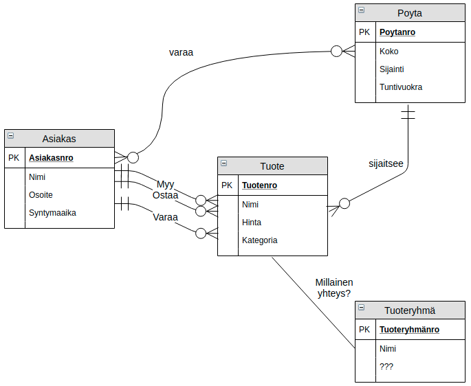
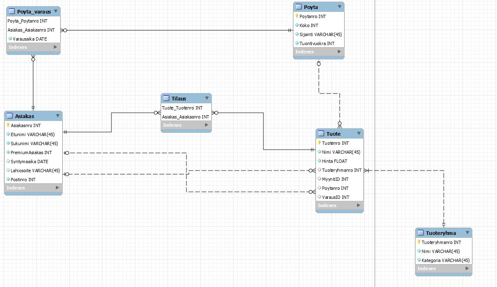
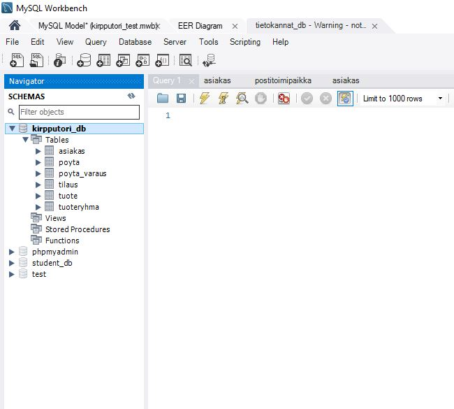

# Normalisointi

## Harjoitus 4 - Tehtävä 1  
<details markdown="1">
<summary>Tehtävänanto</summary>
Oheinen kuva esittää alustavaa luonnosta käsitemalliksi tietokantaratkaisulle, jolla hallitaan kirpputorilla myytäviä kohteita, myyjiä, pöydän varaajia, ostajia, pöydän numeroita ja mahdollisia varauksia. Myytävistä kohteista voidaan tallentaa mm. nimi, kuva, hinta ja kategoria (esim. vaate, videopeli, tietokoneen osa)<br>

<br>
Mallissa näkyvät käsitteiden nimet, käsitteiden väliset suhteet ja ominaisuudet ovat vain luonnoksia, mutta antavat selvän suunnan sille, mitä asioita tietokannasta pitäisi löytyä<br><br>
Tehtäväsi on jalostaa Kirpputori-tietokannan yllä esitetystä käsitemallin luonnoksesta EER-kaavio MySQL WorkBench -ohjelmalla. EER-kaaviosi tulee täydentää ja tarkentaa yllä kuvattua toimeksiantoa ja käsitemallin luonnosta seuraavasti:<br><br>

+ Kaaviostasi tulee löytyä vähintään 6 eri taulua<br>
+ Tarkenna ja tarvittaessa lisää tauluihin liittyviä tietoja (ominaisuuksia) edelleen siten, että ominaisuuksia on yhteen laskien vähintään 30kpl.<br>
+ Voit nimetä taulut ja ominaisuudet halutessasi uudelleen (esim. englanniksikin)<br>
+ EER-kaaviosi tulee kuvata myös kaikki tuotteen ja asiakkaan väliset yhteydet (myy/ostaa/varaa). Näin 6 taulun EER-kaaviosta tulisi löytyä lopulta vähintään 7; ehkä 8 eri yhteyttä.<br>
+ Perustele keskeiset käyttämäsi ratkaisut, voit liittää perustelut ytimekkäinä lauseina tekstinä kaavioon tai muulla valitsemallasi tavalla<br>
+ Tarkenna ja tarvittaessa muuta erityisesti käsitemalliluonnoksessa näkyviä alustavia yhteyksien lukumääräsuhteita (yksi-yhteen, yksi-moneen, moni-moneen) ja yhteyksien pakollisuuksia (esim. tuote on sijaittava aina tasan yhdellä pöydällä)<br>
+ Voit toteuttaa tehtävänannosta halutessasi vain ne osat, jotka osaat tai saat aikaan mielekkäällä työmäärällä ja merkitä tehtävästä sitten osapisteitä.<br>

Kaavio tulee esittää graafisessa muodossa. Ota esim. PNG-kuvakaappaus EER-mallistasi siten, että ratkaisusi näkyy siitä selvästi eli taulut nimineen, niiden ominaisuudet tietotyyppeineen, taulujen yhteydet ja perustelut. Kuvakaappaus voi olla osa muuta dokumentaatiotasi.

Tässä tehtävässä tietokantaa ei tarvitse fyysisesti luoda (Forward Engineer). Riittää että esität EER-mallin perusteluineen.
</details>

Aloitan luomalla uuden EER-kaavion MySQL Workbenchillä. Luon uudet käsitteet ja annan niille omat ominaisuudet kuten tehtävänannossa on kerrottu.  

Lopulta minun EER-kaavio näyttää tältä:  

  

**SELITTEET:**  

- Tuotteen tilaukselle on tehty oma yksilö.  
- Pöydän varaukselle on tehty oma yksilö. Tästä voi nähdä kuka on varannut minkä pöydän ja miltä aikaväliltä.  

**Relaatiot:**  

Asiakas  
- Voi olla monta tilausta tai ei yhtään.  
- Voi olla monta varausta/myyntiä tai ei yhtään.  
- Voi olla monta pöydän varausta tai ei yhtään.  

Tuote  
- Voi olla vain yhdessä tai ei missään pöydässä.  
- On oltava vain yhdessä tuoteryhmässä.  
- On oltava vain yksi myyjä
- Voi olla monessa tilauksessa tai ei missään.  
- Voi olla vain yhdessä varauksessa tai ei missään.  

Pöytä  
- Voi olla monesti varattuna tai ei ollenkaan. (Erit aikavälit)  
- Voi olla monta tuotetta tai ei ollenkaan.  

Tässä EER-kaaviossa on 6 taulua ja 30 eri attribuuttia. Kaikki halutut relaatiot on mallennettu.  

## Harjoitus 4 - Tehtävä 2

<details markdown="1">
<summary>Tehtävänanto</summary>
<br>
Toteuta edellä määrittelemäsi tietokanta Workbenchillä haluamallesi tietokantapalvelimelle (esim. XAMPP, Mariadb.labranet.jamk.fi) Forward Engineer -toiminnolla. Osoita tekstein ja parilla/muutamalla kuvaruutukaappauksella, että onnistuit tietokannan luomaan. <br>
Lisäksi esitä Workbenchin generoimat SQL-lauseet tietokannan luomiseksi. Tietokantaan ei tarvitse lisätä dataa. Voit saada pisteitä tehtävästä vaikka et onnistu luomaan tietokantaa mallistasi. Tällöin esitä virheet ja mahdolliset pohdintasi/syyt virheille.
</details>

Otan tehtävä 1:sen EER-kaavion ja toteutan sen `Forward Engineer` -toiminnolla.  

Saan tästä seuraavan SQL skriptin:  

```
-- MySQL Workbench Forward Engineering

SET @OLD_UNIQUE_CHECKS=@@UNIQUE_CHECKS, UNIQUE_CHECKS=0;
SET @OLD_FOREIGN_KEY_CHECKS=@@FOREIGN_KEY_CHECKS, FOREIGN_KEY_CHECKS=0;
SET @OLD_SQL_MODE=@@SQL_MODE, SQL_MODE='ONLY_FULL_GROUP_BY,STRICT_TRANS_TABLES,NO_ZERO_IN_DATE,NO_ZERO_DATE,ERROR_FOR_DIVISION_BY_ZERO,NO_ENGINE_SUBSTITUTION';

-- -----------------------------------------------------
-- Schema kirpputori_db
-- -----------------------------------------------------

-- -----------------------------------------------------
-- Schema kirpputori_db
-- -----------------------------------------------------
CREATE SCHEMA IF NOT EXISTS `kirpputori_db` ;
USE `kirpputori_db` ;

-- -----------------------------------------------------
-- Table `kirpputori_db`.`Asiakas`
-- -----------------------------------------------------
CREATE TABLE IF NOT EXISTS `kirpputori_db`.`Asiakas` (
  `Asiakasnro` INT NOT NULL,
  `Etunimi` VARCHAR(45) NOT NULL,
  `Sukunimi` VARCHAR(45) NOT NULL,
  `PremiumAsiakas` INT NOT NULL,
  `Syntymaaika` DATE NULL,
  `Lahiosoite` VARCHAR(45) NULL,
  `Postinro` INT NOT NULL,
  PRIMARY KEY (`Asiakasnro`))
ENGINE = InnoDB;


-- -----------------------------------------------------
-- Table `kirpputori_db`.`Poyta`
-- -----------------------------------------------------
CREATE TABLE IF NOT EXISTS `kirpputori_db`.`Poyta` (
  `Poytanro` INT NOT NULL,
  `Koko` INT NOT NULL,
  `Sijainti` VARCHAR(45) NOT NULL,
  `Tuontivuokra` INT NOT NULL,
  PRIMARY KEY (`Poytanro`))
ENGINE = InnoDB;


-- -----------------------------------------------------
-- Table `kirpputori_db`.`Tuoteryhma`
-- -----------------------------------------------------
CREATE TABLE IF NOT EXISTS `kirpputori_db`.`Tuoteryhma` (
  `Tuoteryhmanro` INT NOT NULL,
  `Nimi` VARCHAR(45) NOT NULL,
  `Kategoria` VARCHAR(45) NOT NULL,
  `Tuoteryhmanimi` VARCHAR(45) NULL,
  PRIMARY KEY (`Tuoteryhmanro`))
ENGINE = InnoDB;


-- -----------------------------------------------------
-- Table `kirpputori_db`.`Poyta_varaus`
-- -----------------------------------------------------
CREATE TABLE IF NOT EXISTS `kirpputori_db`.`Poyta_varaus` (
  `Poyta_Poytanro` INT NOT NULL,
  `Asiakas_Asiakasnro` INT NOT NULL,
  `Varausaika` DATE NOT NULL,
  PRIMARY KEY (`Poyta_Poytanro`, `Asiakas_Asiakasnro`),
  INDEX `fk_Poyta_has_Asiakas_Asiakas1_idx` (`Asiakas_Asiakasnro` ASC),
  INDEX `fk_Poyta_has_Asiakas_Poyta1_idx` (`Poyta_Poytanro` ASC),
  CONSTRAINT `fk_Poyta_has_Asiakas_Poyta1`
    FOREIGN KEY (`Poyta_Poytanro`)
    REFERENCES `kirpputori_db`.`Poyta` (`Poytanro`)
    ON DELETE NO ACTION
    ON UPDATE NO ACTION,
  CONSTRAINT `fk_Poyta_has_Asiakas_Asiakas1`
    FOREIGN KEY (`Asiakas_Asiakasnro`)
    REFERENCES `kirpputori_db`.`Asiakas` (`Asiakasnro`)
    ON DELETE NO ACTION
    ON UPDATE NO ACTION)
ENGINE = InnoDB;


-- -----------------------------------------------------
-- Table `kirpputori_db`.`Tuote`
-- -----------------------------------------------------
CREATE TABLE IF NOT EXISTS `kirpputori_db`.`Tuote` (
  `Tuotenro` INT NOT NULL,
  `Nimi` VARCHAR(45) NOT NULL,
  `Hinta` FLOAT NOT NULL,
  `Tuoteryhmanro` INT NULL,
  `MyyntiID` INT NULL,
  `Poytanro` INT NULL,
  `VarausID` INT NULL,
  PRIMARY KEY (`Tuotenro`),
  INDEX `fk_Tuote_Tuoteryhma1_idx` (`Tuoteryhmanro` ASC),
  INDEX `fk_Tuote_Asiakas1_idx` (`MyyntiID` ASC),
  INDEX `fk_Tuote_Poyta1_idx` (`Poytanro` ASC),
  INDEX `fk_Tuote_Asiakas2_idx` (`VarausID` ASC),
  CONSTRAINT `fk_Tuote_Tuoteryhma1`
    FOREIGN KEY (`Tuoteryhmanro`)
    REFERENCES `kirpputori_db`.`Tuoteryhma` (`Tuoteryhmanro`)
    ON DELETE NO ACTION
    ON UPDATE NO ACTION,
  CONSTRAINT `fk_Tuote_Asiakas1`
    FOREIGN KEY (`MyyntiID`)
    REFERENCES `kirpputori_db`.`Asiakas` (`Asiakasnro`)
    ON DELETE NO ACTION
    ON UPDATE NO ACTION,
  CONSTRAINT `fk_Tuote_Poyta1`
    FOREIGN KEY (`Poytanro`)
    REFERENCES `kirpputori_db`.`Poyta` (`Poytanro`)
    ON DELETE NO ACTION
    ON UPDATE NO ACTION,
  CONSTRAINT `fk_Tuote_Asiakas2`
    FOREIGN KEY (`VarausID`)
    REFERENCES `kirpputori_db`.`Asiakas` (`Asiakasnro`)
    ON DELETE NO ACTION
    ON UPDATE NO ACTION)
ENGINE = InnoDB;


-- -----------------------------------------------------
-- Table `kirpputori_db`.`Tilaus`
-- -----------------------------------------------------
CREATE TABLE IF NOT EXISTS `kirpputori_db`.`Tilaus` (
  `Tuote_Tuotenro` INT NOT NULL,
  `Asiakas_Asiakasnro` INT NOT NULL,
  `Lahiosoite` VARCHAR(45) NULL,
  `Postinro` VARCHAR(45) NULL,
  PRIMARY KEY (`Tuote_Tuotenro`, `Asiakas_Asiakasnro`),
  INDEX `fk_TuoteREAL_has_Asiakas_Asiakas1_idx` (`Asiakas_Asiakasnro` ASC),
  INDEX `fk_TuoteREAL_has_Asiakas_TuoteREAL1_idx` (`Tuote_Tuotenro` ASC),
  CONSTRAINT `fk_TuoteREAL_has_Asiakas_TuoteREAL1`
    FOREIGN KEY (`Tuote_Tuotenro`)
    REFERENCES `kirpputori_db`.`Tuote` (`Tuotenro`)
    ON DELETE NO ACTION
    ON UPDATE NO ACTION,
  CONSTRAINT `fk_TuoteREAL_has_Asiakas_Asiakas1`
    FOREIGN KEY (`Asiakas_Asiakasnro`)
    REFERENCES `kirpputori_db`.`Asiakas` (`Asiakasnro`)
    ON DELETE NO ACTION
    ON UPDATE NO ACTION)
ENGINE = InnoDB;


SET SQL_MODE=@OLD_SQL_MODE;
SET FOREIGN_KEY_CHECKS=@OLD_FOREIGN_KEY_CHECKS;
SET UNIQUE_CHECKS=@OLD_UNIQUE_CHECKS;
```  

Tämän SQL skriptin jälkeen minulla on uusi tietokanta!  

  


 


