# SQL-funktiot ja -liitokset

## Harjoitus 5 - Tehtävä 1

>A. Hae students-taulusta suurin ja pienin annettu veroprosentti. Anna sarakeotsikoiksi maksimi ja minimi.  

Tämän voi suorittaa komennolla:  

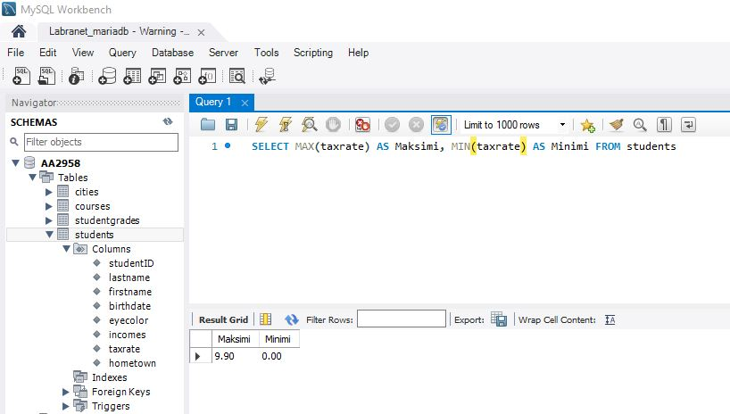  

>B. Montako opintosuoritusta on merkitty studentgrades-tauluun?  

Tämän voi suorittaa komennolla:  

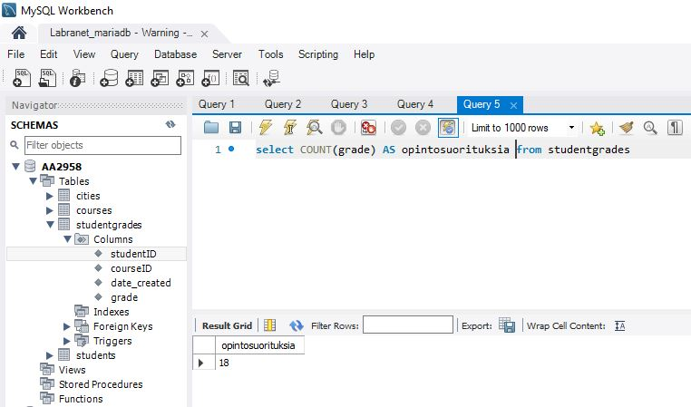  

>C. Laske on opiskelijoiden veroprosenttien keskiarvo. Anna sarakeotsikoiksi Keskiarvo.  

Tämän voi suorittaa komennolla:  

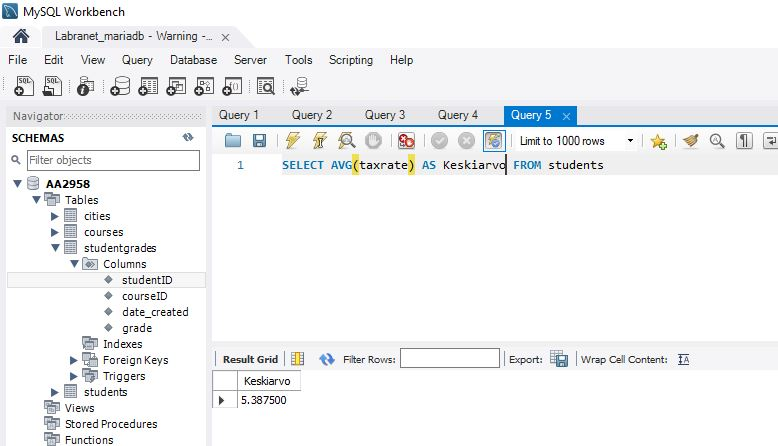  

>D. Paljonko on kaikkien opiskelijoiden tulot yhteensä, Anna tulosrivin otsikoksi Tulot yhteensä  

Tämän voi suorittaa komennolla:  

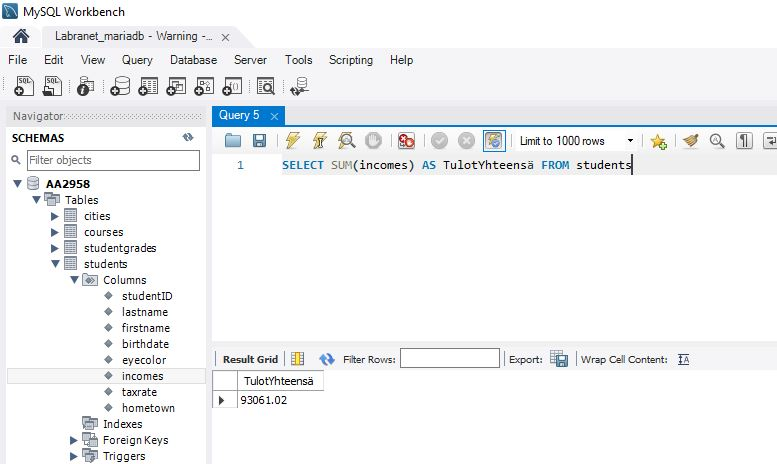  

>E. Montako erilaista silmien väriä opiskelijoilla on henkilo-taulussa? Anna tulosrivin otsikoksi Lukumäärä  

Tämän voi suorittaa komennolla:  

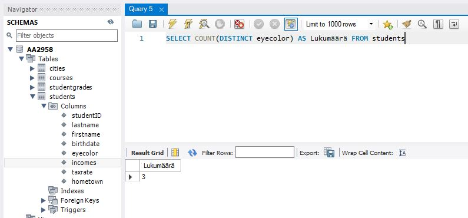  

## Harjoitus 5 - Tehtävä 2

>A. Hae students-taulusta kaikista sukunimistä ensimmäinen merkki.  

Tämän voi suorittaa komennolla:  

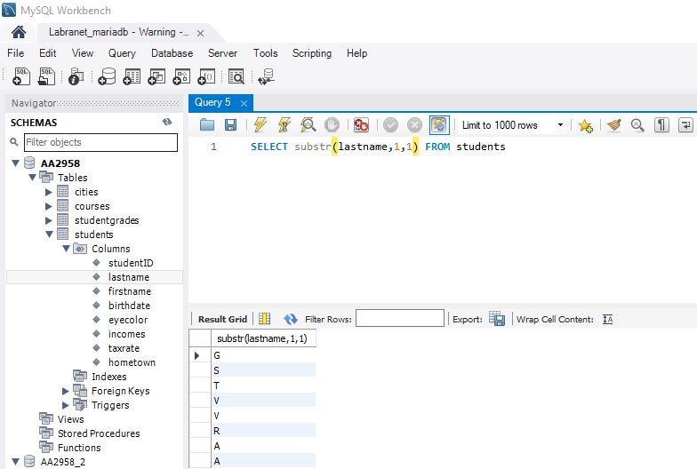  

>B. Hae students-taulusta suku- ja etunimet yhdistettynä seuraavan mallin mukaisesti: Guru, Ken. Anna sarakeotsikoksi Kokonimi.  

Tämän voi suorittaa komennolla:  

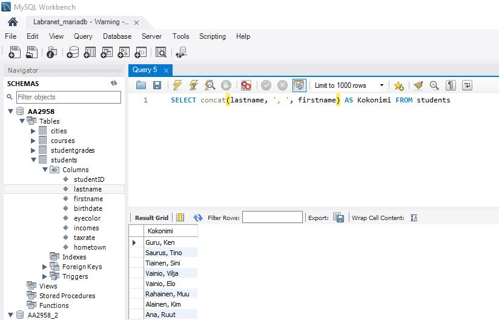  

>C. students-taulun opiskelijoille luodaan käyttäjätunnus, johon otetaan sukunimestä 4 ensimmäistä merkkiä ja etunimestä 4 ensimmäistä merkkiä. Kaikki merkit tulee olla pienillä merkeillä (gemena, pienaakkoset). Jos suku- tai etunimessä ei ole neljää merkkiä, niin merkkien lukumäärä taydennetään neljään lisäämällä osamerkkijonon loppuun merkkejä x siten että 4 merkin vaatimus täytyy. Esimerkit: Saurus Tino -> saurtino, Ana Ruut -> anaxruut. Tee SQL-lause, joka tulostaa kaikille yo. vaatimusten mukaiset käyttäjätunnukset.  

Tämän voi suorittaa komennolla:  

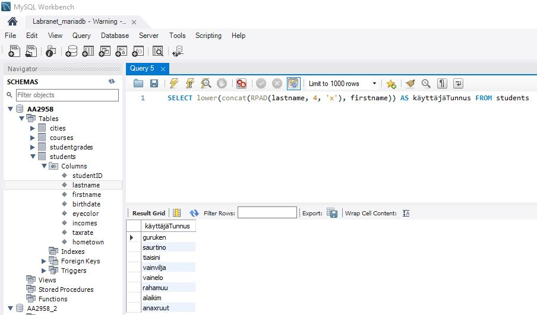  

>D. Hae ne opiskelijat joiden syntymäpäivä on 11.11.2004, 11.11.2005 tai 11.11.2006  

Tämän voi suorittaa komennolla:  

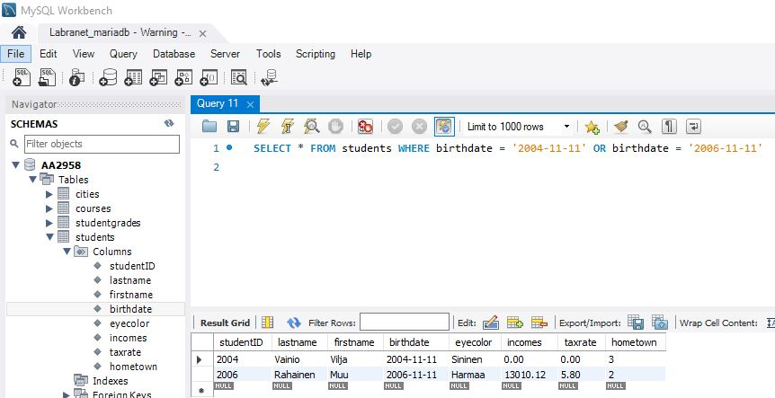  

## Harjoitus 5 - Tehtävä 3

>A. Laske opiskelijoiden tulojen keskiarvo kotikunnittain. Anna sarakeotsikoiksi Kotikunnan ID ja KAtulot. Nämä tiedot voit hakea pelkästään students-taulusta. Kotikunnattomat voi olla omana ryhmänä. Lajittele tulokset suurimmasta pienimpään tulokeskiarvojen mukaan.  

Tämän voi suorittaa seuraavalla komennolla:  

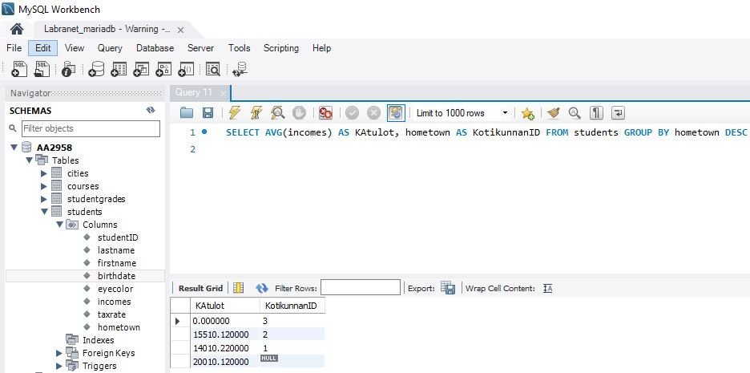  

>B. Sukunimen X-Factor-tekijänä tunnetun toisen merkin on huomattu ennustavan opiskelijan opintomenestystä. Laske nyt opiskelijoiden keskiarvotulot ryhmiteltynä tämän X-Factor-tekijän mukaan. Tuloksessa tulee näkyä myös opiskelijoiden lukumäärä kutakin X-Factor-tekijää kohti. Lajittele keskiarvotulot laskevaan järjestykseen.  

Tämän voi suorittaa seuraavalla komennolla:  

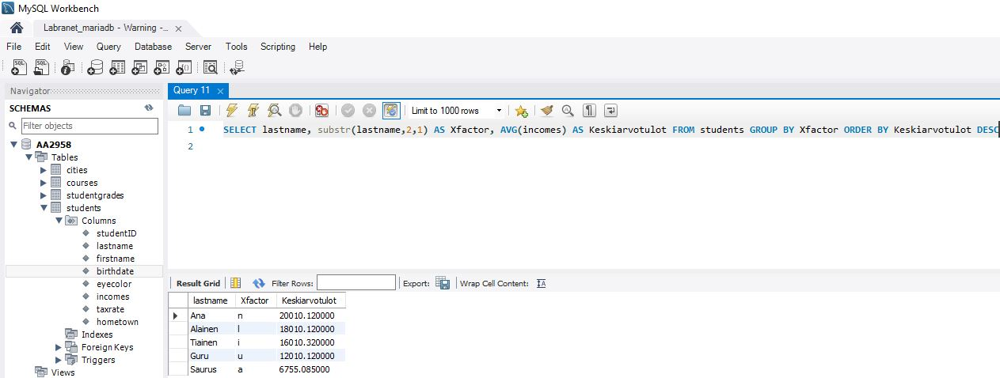  

>C. Laske opiskelijoiden verot tulojen ja veroprosentin avulla. Tulossarakkeet: sukunimi, etunimi, tulot, veroprosentti ja vero. Lajittele lasketun veron mukaan laskevaan järjestykseen.  

Tämän voi suorittaa seuraavalla komennolla:  

  

>D. Mikä on isoimman ja pienimmän kaupungin asukaslukujen erotus? Montako prosenttia isoin asukasluku on suurempi kuin pienin asukasluku? Käytä SQL-lausetta, jossa yhdelle riville tulostuu isoin ja pienin asukaslukumäärä, näiden erotus lukuna ja ero prosentteina. Kaupunkien nimiä ei tarvitse tulostaa.  

Tämän voi suorittaa seuraavalla komennolla:  

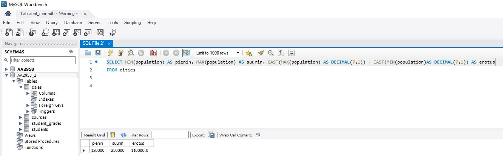 

>E. Hae nimet ja asukaslukuvut kaikista kaupungeista, joiden asukasluku olisi 10 prosentin lisäyksen jälkeen yli 200 000.  

Tämän voi suorittaa seuraavalla komennolla:  

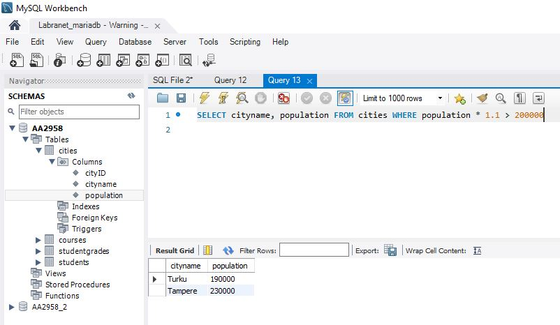 

## Harjoitus 5 - Tehtävä 4

>A. Hae opiskelijan 2003 (studentID) suoritetut opintojaksot arvosanoineen. Opiskelijan nimeä ei tarvitse tulostaa. Tarvitaan siis vain kaksi taulua.  

Tämän voi suorittaa seuraavalla komennolla:  

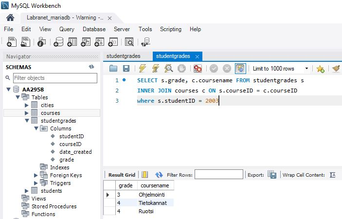 

>B. Hae 8 viimeisintä kurssisuoritusta lajiteltuna uusimmasta vanhimpaan suoritukseen. Riveillä tulee näkyä kurssin nimi, suorituspäivämäärä suomalaisessa muodossa esim. 17.02.2021, opiskelijan tunnus studentID ja opintojakson arvosana.  

Tämän voi suorittaa seuraavalla komennolla:  

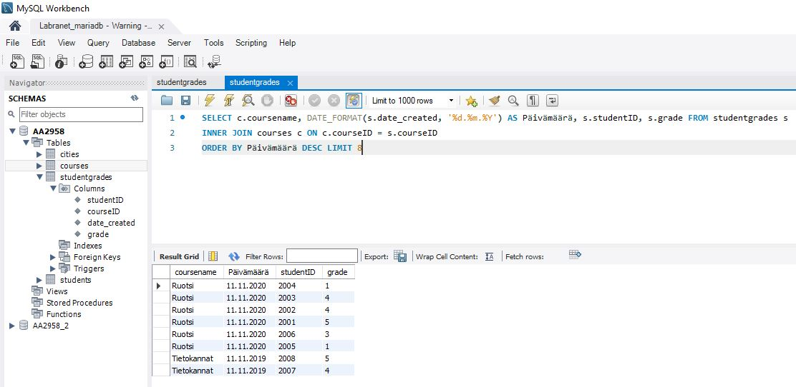  

>C. Hae opiskelijoittain heidän kaikkien opintojaksosuoritusten keskiarvo. Tulosta opiskelijoiden sukunimi, etunimi ja laskettu keskiarvo.  

Tämän voi suorittaa seuraavalla komennolla:  

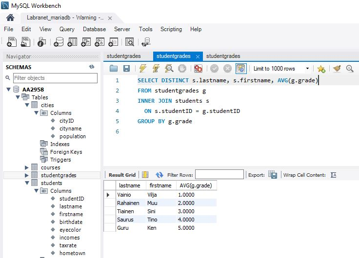  

## Harjoitus 5 - Tehtävä 5

>A. Hae silmien väreittäin keskimääräiset asukasluvut. Ota mukaan omaksi ryhmäksi myös ne joiden silmien väriä ei tiedetä.  

Tämän voi suorittaa seuraavalla komennolla:  

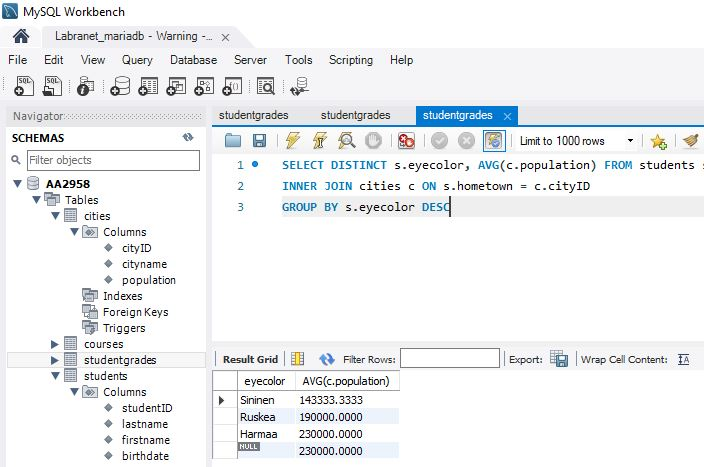  

>B. Hae kotikaupungeittain ja opintojaksottain kaikkien opintojaksosuoritusten keskiarvo.  

Tämän voi suorittaa seuraavalla komennolla:  

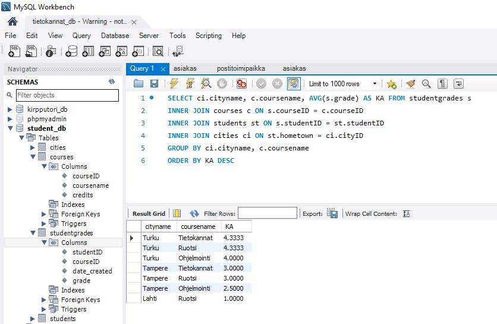  

>C. Hae opiskelijat tuloineen siten, että ylimääräiseen sarakkeeseen tulee merkintä pienituloinen niille, joiden tulot ovat 15000 tai alle ja muille tähän sarakkeeseen tulee merkintä isotuloinen . Lajittele suurituloisimmista pienituloisimpaan.  

Tämän voi suorittaa seuraavalla komennolla:  

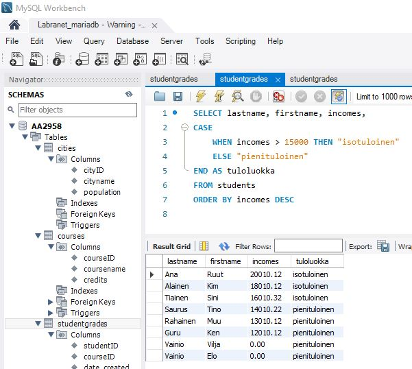  