# SQL-taulujen luonti ja muokkaus

## Harjoitus 6 - Tehtävä 1

<details markdown="1">
<summary>Tehtävänanto</summary>

Luo 'Persons' -niminen tietokannan taulu, jossa on sarakkeet<br>
+ 'hetu', kiinteämittainen merkkijono 11 merkkiä, perusavain<br>
+ 'sukunimi', vaihtuvamittainen merkkijono max 64 merkkiä, pakollinen<br>
+ 'etunimi', vaihtuvamittainen merkkijono max 64 merkkiä, pakollinen<br>
+ 'email', vaihtuvamittainen merkkijono max 128 merkkiä, ei ole pakollinen, mutta kahta täsmälleen samanlaista sähköpostiosoitetta ei voi tallentaa<br>
+ 'biologinen_sukupuoli', vaihtuvamittainen merkkijono max 32 merkkiä, pakollinen. Sallitut arvot ovat vain 'mies', 'nainen', 'intersukupuolinen'.<br>
+ 'fobia', vaihtuvamittainen merkkijono max 64 merkkiä, pakollinen, oletusarvo on 'hippopotomonstrosesquippedaliofobia'<br>
Tämän tehtävän vastauksena tulee palauttaa SQL-lause taulun luomiseksi sekä desc Persons-käskyn tulostus ja mahdolliset lisäkommentit.
</details>

Luon uuden pöydän seuraavalla SQL komennolla:  

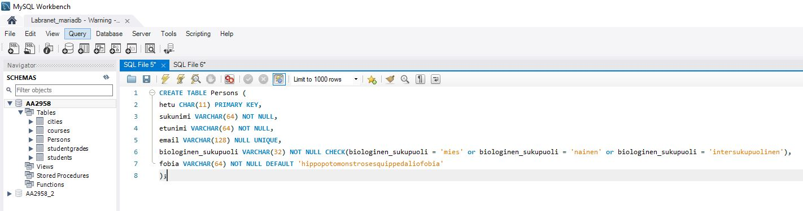  

Tästä syntyy pöytä jonka DESC. näyttää tältä:  

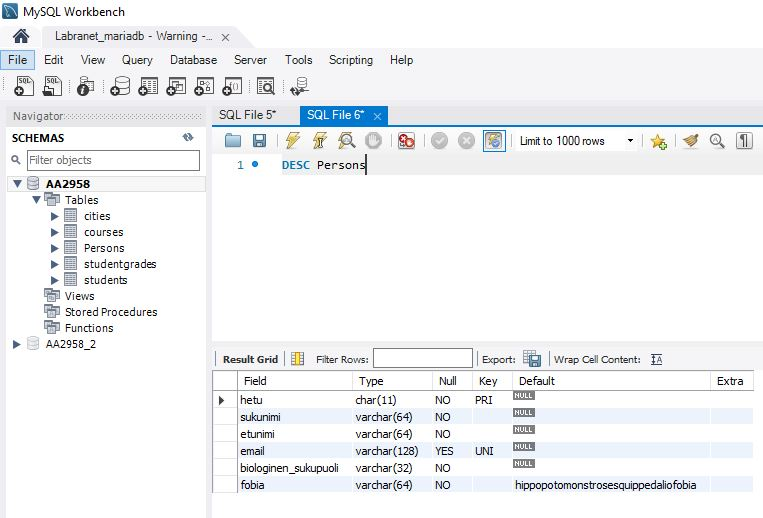  

## Harjoitus 6 - Tehtävä 2

<details markdown="1">
<summary>Tehtävänanto</summary>

Lisää `INSERT INTO` -lausein tehtävän 1 `Persons`-tauluun oheinen sisältö. Vainion Viljan fobia tulee tallentua ilman, että kirjoitat sitä näkyviin `INSERT INTO` -lauseessasi

```
mysql> select * FROM Persons;
+-------------+----------+---------+----------------+----------------------+-------------------------------------+
| hetu        | sukunimi | etunimi | email          | biologinen_sukupuoli | fobia                               |
+-------------+----------+---------+----------------+----------------------+-------------------------------------+
| 121212-1234 | Guru     | Ken     | NULL           | intersukupuolinen    | fobofobia                           |
| 121212-1235 | Vainio   | Elo     | elo@mail.com   | mies                 | panofobia                           |
| 121212-1236 | Vainio   | Vilja   | vilja@mail.com | nainen               | hippopotomonstrosesquippedaliofobia |
+-------------+----------+---------+----------------+----------------------+-------------------------------------+
3 rows in set (0.00 sec)
```

Osoita `INSERT INTO` -lausein, että `Persons`-tauluun ei voi lisätä rivejä joissa  

A. `sukupuoli` ei ole sallittujen sukupuolten joukossa
B. `email` on täsmälleen sama kuin jollakin jo tauluun jo tallennetulla henkilölllä
C. `hetu` on liian pitkä  

Tämän tehtävän vastauksena tulee palauttaa kaikki käyttämäsi `INSERT INTO` -lauseet (6kpl) ja virheilmoitukset näiden kolmen viimeisen `INSERT INTO` -operaation epäonnistumisesta.  

</details>

Lisää INSERT INTO -lausein tehtävän 1 Persons-tauluun oheinen sisältö. Vainion Viljan fobia tulee tallentua ilman, että kirjoitat sitä näkyviin INSERT INTO -lauseessasi.  

Lisään kyseisen sisällön seuraavilla komennoilla:  

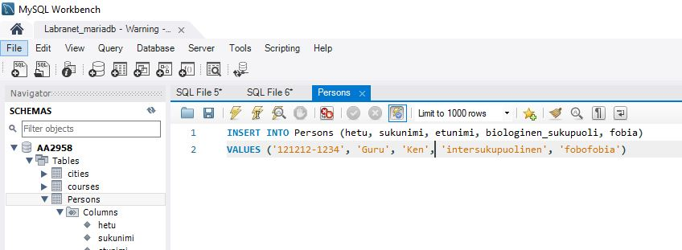  
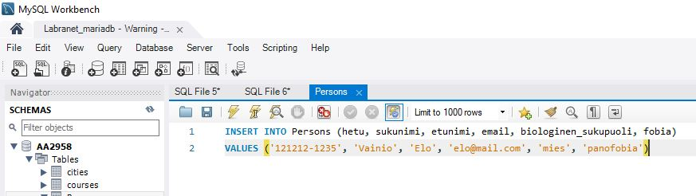  
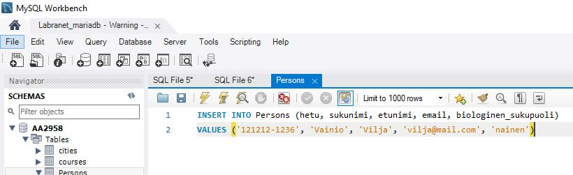  

Lopulta Persons -taulu näyttää tältä:  

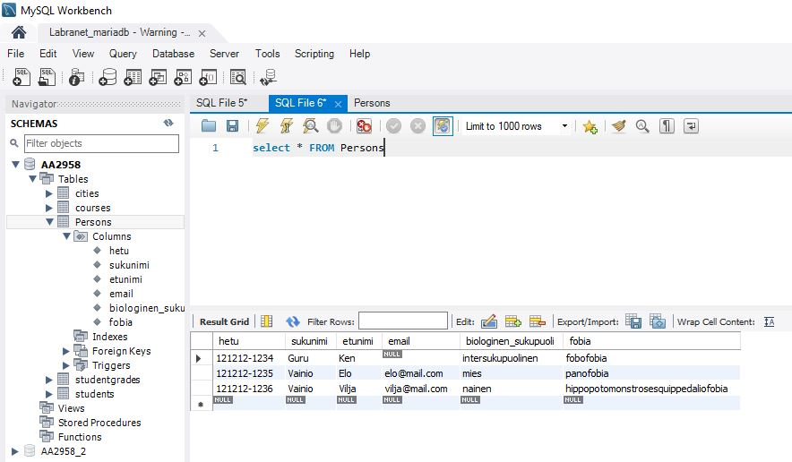  

A) Sukupuoli ei ole sallittujen sukupuolten joukossa  

Lisään sukupuolen kohdalle arvon 'mörkö':  

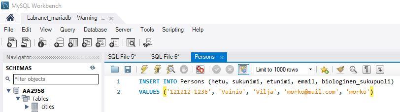  

  

B) Email on täsmälleen sama kuin jollakin jo tauluun jo tallennetulla henkilölllä  

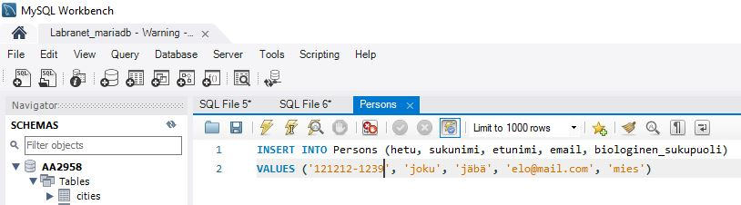  

  

C) Hetu on liian pitkä  

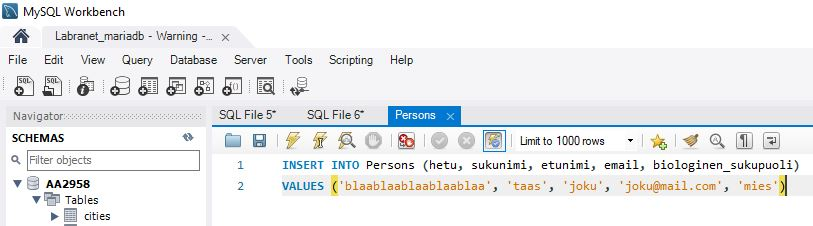  

  

## Harjoitus 6 - Tehtävä 3

<details markdown="1">
<summary>Tehtävänanto</summary>
Tässä tehtävässä tarvitaan tehtävissä 1 ja 2 luotua `Persons`-taulua 3 rivin sisältöineen.<br>
Luo lisäksi taulu `PhoneManufacturers`, jossa on sarakkeet<br>

* (1A) 'id', kokonaisluku, automaattisesti kasvava sarake, pakollinen, perusavain<br>
* (1B) 'manufacturer', vaihtuvamittainen merkkijono max 32 merkkiä, pakollinen<br>

Luo lisäksi taulu 'PhoneNumbers', jossa on sarakkeet:<br><br>


* (2A) 'phonenumber', vaihtuvamittainen merkkijono max 64 merkkiä, pakollinen, perusavain<br>
* (2B) 'hetu', kiinteämittainen merkkijono 11 merkkiä, pakollinen. Tämä sarake toimiii viiteavaimena Persons-taulun hetu-sarakkeeseen (perusavain). Vyörytyssääntönä on sekä DELETE- että UPDATE-operaatioille kieltää sellaisten isätaulun henkilöiden poistaminen/muuttaminen, joilla on puhelinnumeroita.<br>
* (2C) 'manufacturerID', kokonaisluku, ei pakollinen, oletusarvo NULL. Tämä sarake toimiii viiteavaimena 'PhoneManufacturers-taulun' 'id'-sarakkeeseen (perusavain). Vyörytyssääntönä on sekä DELETE- että UPDATE-operaatioille asettaa isätaulun valmistajaksi NULL silloin, kun ollaan poistamassa/muuttamassa sellaisen valmistajan tietoja, joihin on liitettynä puhelinnumeroita.<br><br>

---<br><br>

Lisää 'INSERT INTO' -lausein 'PhoneManufacturers'-tauluun puhelinvalmistaja Samsung ja Apple. Lisää henkilölle Ken Guru puhelin numeroineen, jonka valmistaja on Samsung. Lisää henkilöille Elo Vainio ja Vilja Vainio puhelimet numeroineen, joiden valmistaja on Apple.<br>

---<br><br>

Poista 'PhoneManufacturers'-taulusta valmistaja Samsung ja totea että käyttäjän Ken Guru puhelinvalmistaja on NULL tämän operaation jälkeen.  <br>

Yritä poistaa käyttäjä Vilja Vainio 'Persons'-taulusta ja totea, että poisto ei onnistu vyörytyssääntöjen takia.<br>

---<br><br>

Tämän tehtävän vastauksena tulee palauttaa kaikki tehtävän ratkaisemiseksi käyttämäsi SQL-lauseet ja mahdolliset näytteet operaatioiden onnistumisesta tai epäonnistumisista.  

</details>


Luon kyseiset taulut tietokantaani seuraavilla komennoilla:  

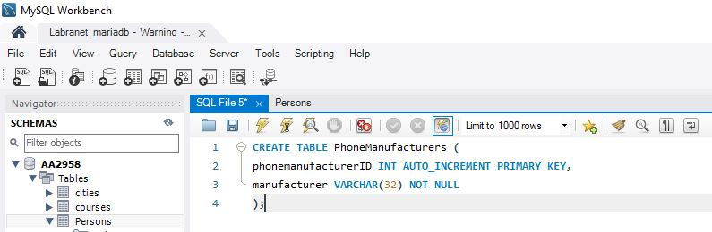  

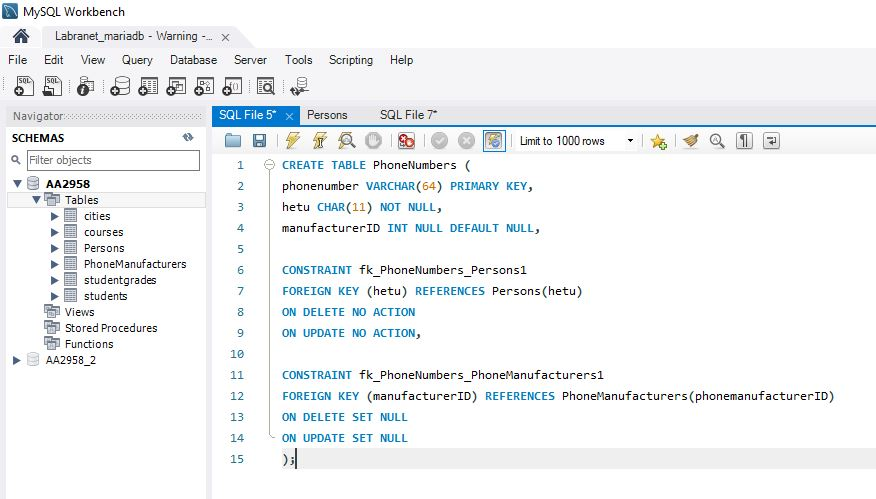  

Syötän PhoneManufacturers -tauluun seuraavat tiedot:  

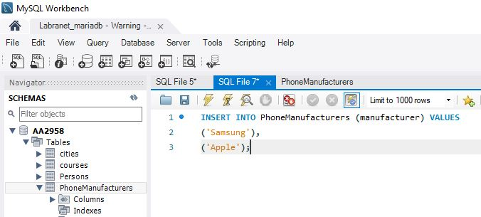  

Jonka jälkeen lisään PhoneNumbers -tauluun omat tiedot jonka jälkeen voin päivittää Persons -taulun.  

Lopulta kaikki henkilöt saavat puhelin numerot ja valmistajat:  

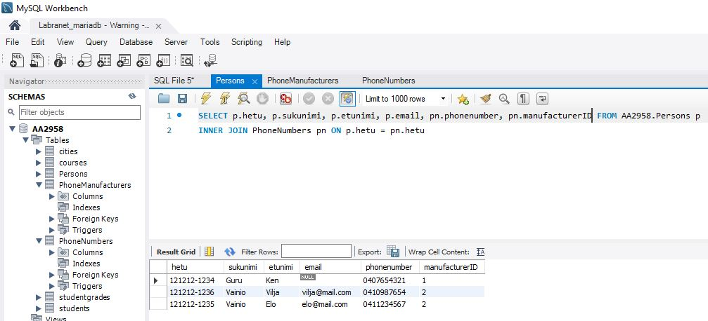  

Nyt poistan PhoneManufacturers -taulusta valmistajan Samsung ja tarkistan Ken Gurun puhelinvalmistajan arvon:  

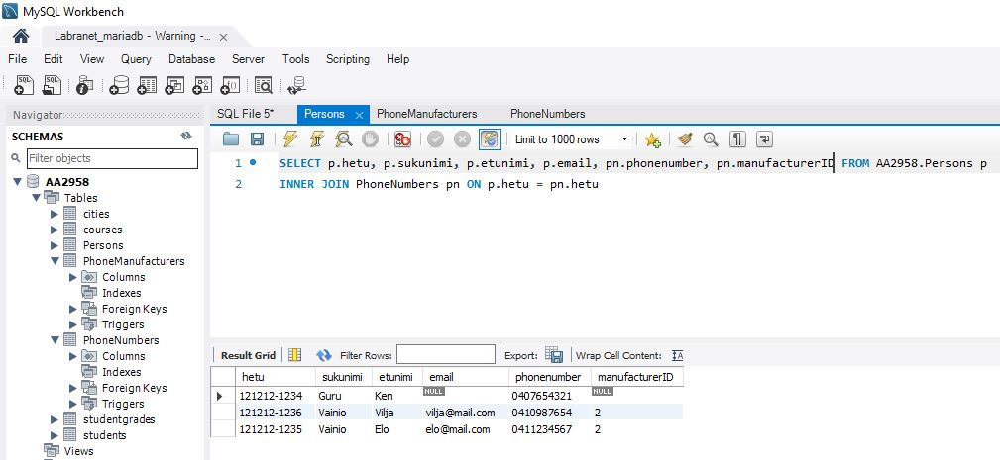  

manufacturerID on NULL.  

Nyt koitan poistaa käyttäjän Vilja Vainion ja katson, mitä käy:  

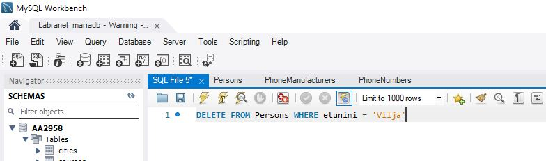  

Tästä saan virheilmoituksen:  

  

Tämä käy järkeen, koska asetin vyörytyssäännöt kieltämään kyseiset poistot ja päivitykset.  

## Hajoitus 6 - Tehtävä 4

<details markdown="1">
<summary>Tehtävänanto</summary>

Tee alustava karkea harjoitustyön suunnitelma. Pyri vastaamaan suunnitelmalla seuraaviin kysymyksiin<br><br>

* Mikä on harjoitustyösi aihe?<br>
* Millainen voisi olla ytimekäs muutaman virkkeen toimeksianto harjoitustyöllesi?<br>
* Mitkä ovat kaikista keskeisimmät asiat, joista tietoa tallennetaan tietokantaan?<br>
* Millaiset voisivat olla ihan keskeisimmät käsitteet/taulut, joita harjoitustyössäsi tarvitaan? Voit piirtää halutessasi kaavion ihan kynälllä paperille (palautukseen kuva), draw.io:lla jne.<br>
* Mikä on alustava harjoitustyöryhmäsi kokoonpano?<br>
Muuta?<br><br>

Tämän suunnitelman ei tarvitse toteutua, mutta jokaisen tästä tehtävästä pisteitä haluavan on esitettävä tässä vaiheessa tämä suunnitelma. Kaikki samaan ryhmään (tässä vaiheessa) kuuluvat voivat esittää saman suunnitelman.<br>

* Suunnitelman laajuus A4-tulosteena noin 1/2-1 sivua!<br>
* Palautusformaatti vapaa

</details>


Tee alustava karkea harjoitustyön suunnitelma.  

* Mikä on harjoitustyösi aihe?  

Aiheena on luoda verkkokaupan tietokanta.  

* Millainen voisi olla ytimekäs muutaman virkkeen toimeksianto harjoitustyöllesi?  

Tehtävänä on luoda verkkokaupalle tietokanta. Tietokannan avulla verkkokauppa pystyy myymään tuotteita, pitämään inventaariota ja luomaan kuitteja. Tämän lisäksi verkkokaupan asiakkaat pystyvät selaamaan tuotteita ja valitsemaan minne ostetut tavarat lähetetään.  

* Mitkä ovat kaikista keskeisimmät asiat, joista tietoa tallennetaan tietokantaan?  

Tietoa tallennetaan ainakin seuraavista asioista:  

1. Asiakkaista
2. Tavaroista/tuotteista
3. Tilauksista
4. Kuiteista

* Millaiset voisivat olla ihan keskeisimmät käsitteet/taulut, joita harjoitustyössäsi tarvitaan? Voit piirtää halutessasi kaavion ihan kynälllä paperille (palautukseen kuva), draw.io:lla jne.  

**Käsitteitä:**  

Asiakas
- AsiakasID
- Etunimi
- Sukunimi
- Osoite

Tuote
- TuoteID
- Nimi
- Kuvaus
- Hinta
- Kategoria

Tilaus (Tästä luodaan kuitti)
- TilausID
- AsiakasID
- Osoite
- MaksettuHinta
- PostinSeurantanumero
- Päivämäärä

Inventaario
- InventaarioID
- Tuote
- Määrä
- Sijainti

Tästä voin tehdä nopean ER -kaavion DrawIO:lla:  

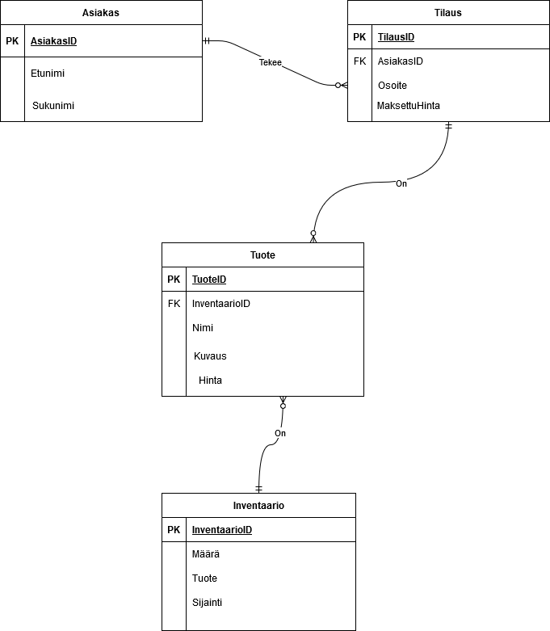  

Tästä voi nähdä tärkeimmät taulut ja niiden relaatiot.  

* Mikä on alustava harjoitustyöryhmäsi kokoonpano?  

Herkko Mehtälä (Minä)  

Eli minä tekisin tämän projektin itse.


