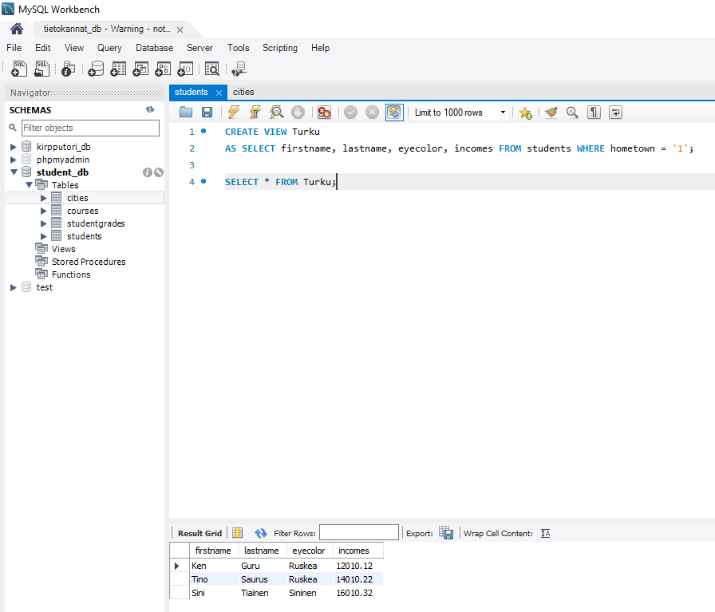
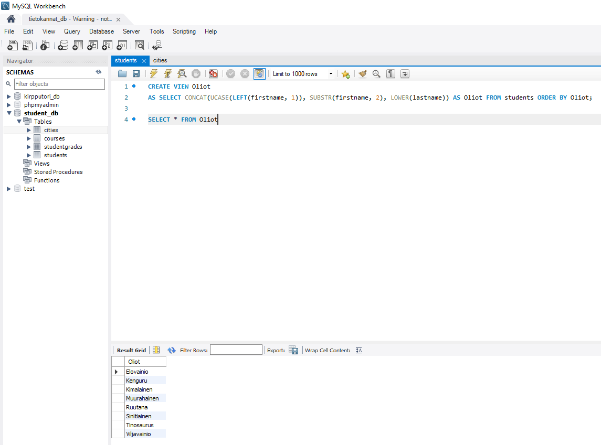
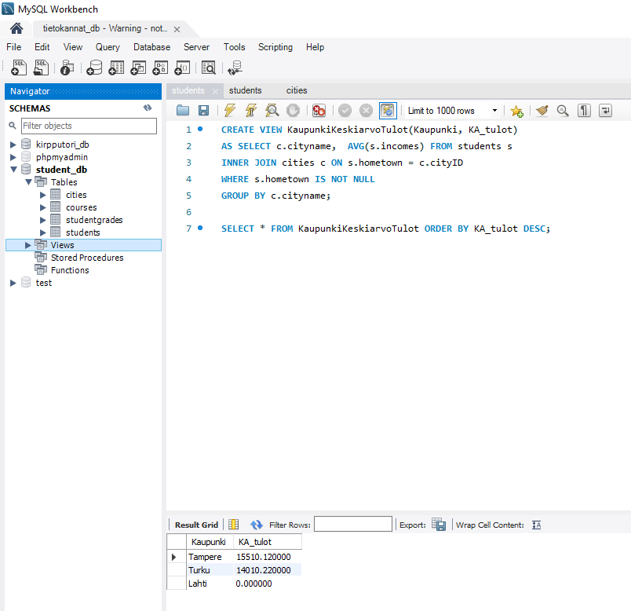
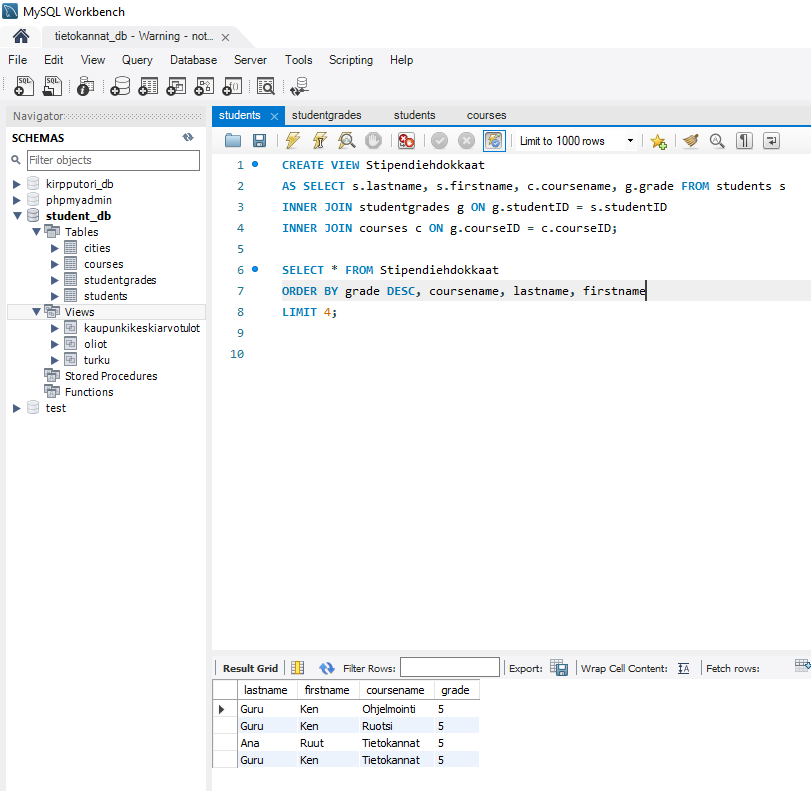
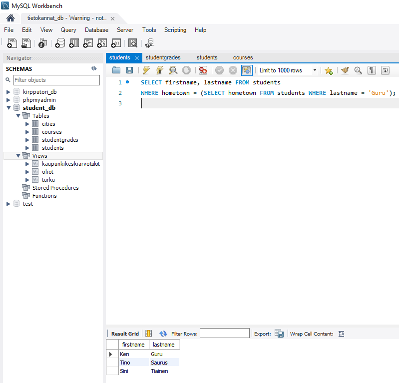
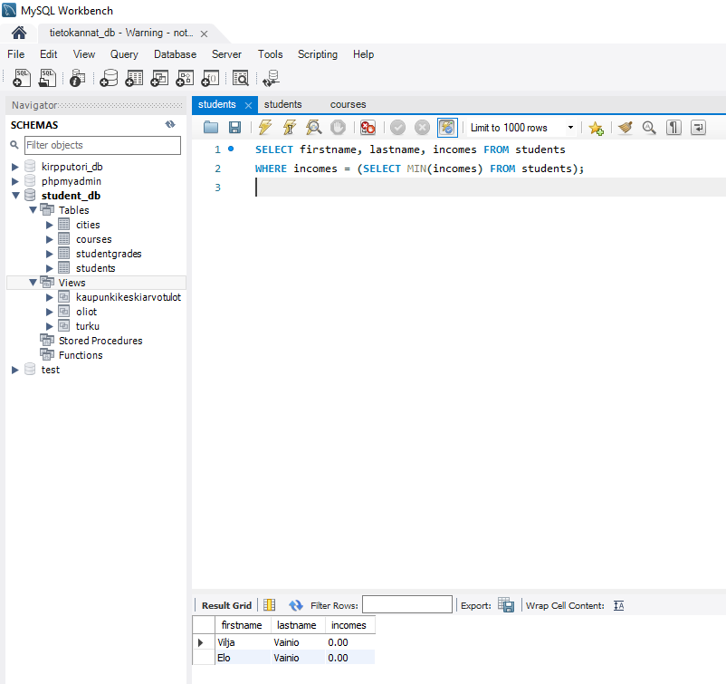
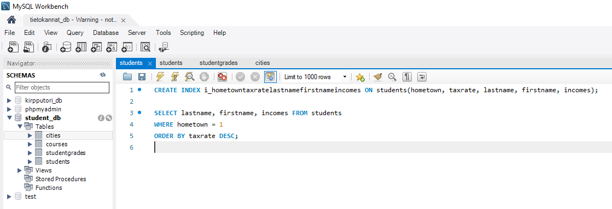

# Alikyselyt, näkymät ja indeksointi

## Harjoitus 7 - Tehtävä 1

>A) Tee näkymä Turku, joka hakee students-taulusta kaikki turkulaiset opiskelijat. Sarakkeista tulostetaan mukaan järjestyksessä seuraavat: firstname, lastname, eyecolor ja incomes. Testaa näkymän toiminta kokeilemalla sitä.  

Tämän voi suorittaa seuraavalla komennolla:  

  

>B) Tee näkymä Oliot, joka tulostaa kaikki students-taulun opiskelijoiden nimet yhdessä sarakkeessa muodossa Etunimisukunimi. Esim. Kenguru, Tinosaurus, jne. Vain ensimmäinen merkki voi tulostua isolla (suuraakkonen, versaali). Sarakkeen otsikko tulee olla myös Oliot. Näkymää käytettäessä oliot tulee tulostaa aakkosjärjestyksessä. Testaa näkymän toiminta kokeilemalla sitä. Vastauksessa tulee olla näkyvillä näkymän luonti ja sen testaaminen.  

Tämän voi suorittaa seuraavalla komennolla:  

  

## Harjoitus 7 - Tehtävä 2

>A) Tee näkymä KaupunkiKeskiarvoTulot joka tulostaa opiskelijoiden keskiarvotulot kaupungeittain. Tulostuksessa näytetään kunkin kaupungin nimi ja kaupunkikohtaiset keskiarvotulot ja sarakkeiden otsikot tulee olla Kaupunki ja KAtulot. Kotikaupungittomia ei oteta mukaan tähän näkymään. Näkymää käytettäessä kaupungit tulee lajitella keskiarvotulon perusteella laskevassa järjestyksessä. Testaa näkymän toiminta kokeilemalla sitä. Vastauksessa tulee olla näkyvillä näkymän luonti ja sen testaaminen.  

Tämän voi suorittaa seuraavalla komennolla:  

  

>B) Tee näkymä Stipendiehdokkaat jonka avulla voidaan tulostaa 4 parasta opintosuoritusta. Riveittäin näkyy opiskelijan sukunimi, etunimi, kurssi ja kurssiarvosana, kuten alla mallissa. Arvosanan lisäksi lajitteluehdot ovat järjestyksessä kurssin nimi (ASC), sukunimi (ASC) ja etunimi(ASC). Testaa näkymän toiminta kokeilemalla sitä. Vastauksessa tulee olla näkyvillä näkymän luonti ja sen testaaminen.  

Tämän voi suorittaa seuraavalla komennolla:  

  

## Harjoitus 7 - Tehtävä 3

>A) Hae ne opiskelijat (suku- ja etunimellä), joilla on sama kotikunta kuin Ken Gurulla. Ken Gurun kotikuntaa ei tiedetä kyselyä kirjoitettaessa (se voi olla mikä tahansa). Käytä alikyselyä.  

Tämän voi suorittaa seuraavalla komennolla:  

  

>B) Hae pienituloisimmat opiskelijat. Pienintä palkkaa ei tiedetä kyselyä kirjoitettaessa. Tulossarakkeina suku- ja etunimi sekä tulot. Käytä alikyselyä.  

Tämän voi suorittaa seuraavalla komennolla:  

  

## Harjoitus 7 - Tehtävä 4

Ei tehtäviä

## Harjoitus 7 - Tehtävä 5

Luo nk. 3 tähden paksu indeksi SQL-kyselylle  

```
SELECT lastname, firstname, incomes
FROM students
WHERE hometown = 1
ORDER BY taxrate DESC;
```  

Tämän voi tehdä seuraavalla komennolla:  

  


