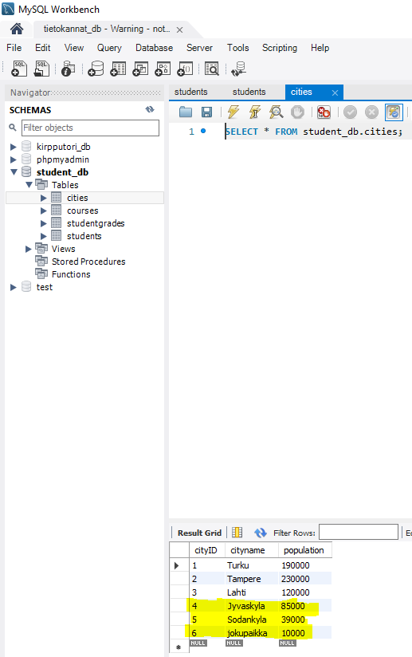
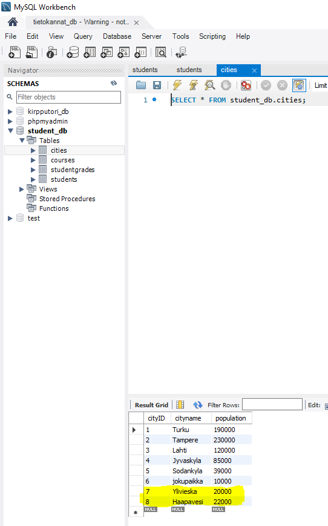
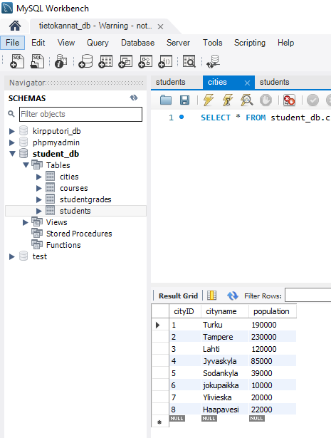

# Transaktiot, herättimet ja rollback

## Harjoitus 8 - Tehtävä 1

>Luo sellainen triggeri opintojakson esimerkkitietokantaan `http://netisto.fi/oppaat/tietokannat/?id=03`, että yli miljoonan asukkaan kotikaupunkeja ei voi lisätä INSERT INTO -lauseella cities-tauluun.  

Tämän voi tehdä seuraavalla komennolla:  

  

Tästä syntyy virheilmoitus:  

  

## Harjoitus 8 - Tehtävä 2

>Luo transaktio jossa opintojakson esimerkkitietokannan `http://netisto.fi/oppaat/tietokannat/?id=03`  
>
>1) cities-tauluun lisätään kaksi uutta kaupunkia yhdellä INSERT INTO -lauseella JA  
>2) students-tauluun lisätään kaksi uutta opiskelijaa yhdellä INSERT INTO -lauseella, joiden kotikuntana on jompikumpi kohdassa A) lisätyistä kotikaupungeista  

Tämän voi suorittaa seuraavalla komennolla:  

  

Tarkistan transaktion...  

  
  

Kaikki lisäykset on lisätty onnistuneesti!  

## Harjoitus 8 - Tehtävä 3

>Luo transaktio jossa opintojakson esimerkkitietokannan `http://netisto.fi/oppaat/tietokannat/?id=03`  
>
>1) cities-tauluun lisätään kaksi uutta kaupunkia yhdellä INSERT INTO -lauseella JA  
>2) students-tauluun lisätään kaksi uutta opiskelijaa yhdellä INSERT INTO -lauseella, joiden studentID on virheellisesti sama.  

Tämän voi suorittaa seuraavalla komennolla:  

  

Tarkastetaan transaktiot...  

  
  

Kaupunkien lisäys onnistui, mutta opiskelijan lisäys ei onnistunut!  

## Harjoitus 8 - Tehtävä 4 

>Luo edellisen tehtävän transaktion yhteyteen sellainen sp_fail()-niminen tallennettu proseduuri (stored procedure), jota kutsuessa kaikki INSERT INTO-lauseet peruutetaan (ROLLBACK), jos yhdenkin suoritus epäonnistuu jostakin syystä. Jos kaikki INSERT INTO -lauseet ovat suoritettavissa, transaktio hyväksytään kokonaisuudessaan (COMMIT).  
>
>Tämän voi tehdä seuraavalla komennolla:  

  

Tämä tuottaa virheilmoituksen `duplicate entry PRIMARY KEY` students-taulussa, joten proseduurin SQLEXCEPTION handler muuttaa `_rollback` -muuttujan 1, joka aiheuttaa ROLLBACK:in ajamisen. Tämä poistaa myös uudet kaupungit cities-taulussa. Tarkastetaan tilanne...  

  
  

students-taulussa ei ole tapahtunut muutoksia, mutta ei myöskään cities-taulussa! `sp_fail()` proseduuri onnistui rollbackin teossa!  