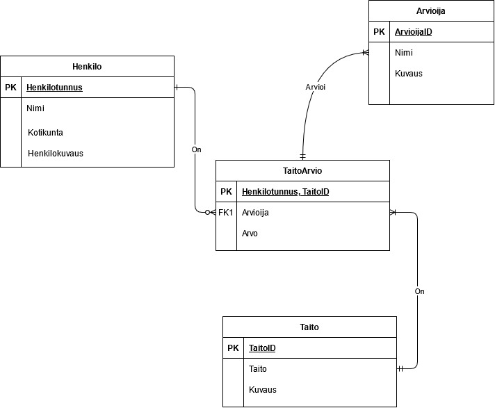
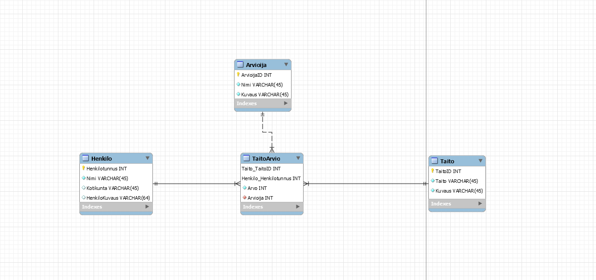
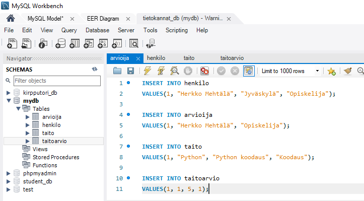
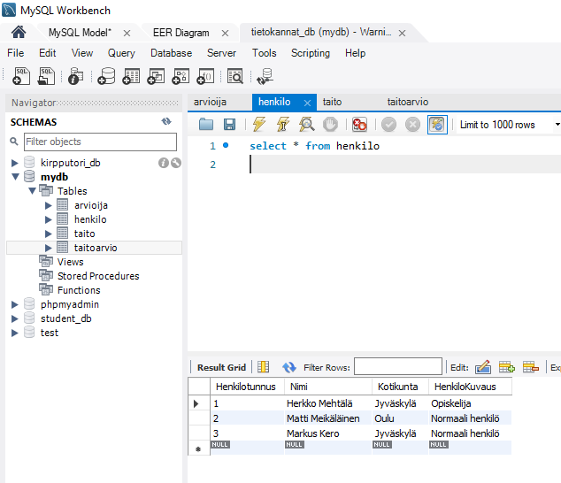
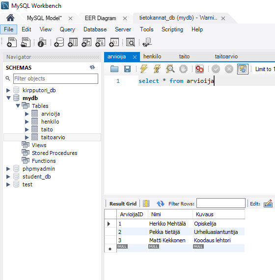
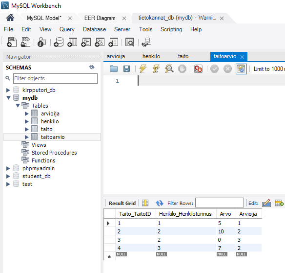

# Kertausharjoitus

## Harjoitus 9 - Tehtävä 1

>Tehtävä: Suunnittele ja toteuta tietokanta.  
>Aihe: todennetun osaamisen rekisteri (TOR)  
>Toimeksiantaja: Opetus- ja kulttuuriministeriö tai esim. yrityksen/oppilaitoksen projektitoimisto. Lisätietoja: Ari Rantala.  

**Pakolliset toiminnot/tallennettavat tiedot:**  

1. Henkilötietojen ylläpito (vähintään henkilön nimi)  
2. Osaamistietojen ylläpito (vähintään taidon nimi ja tarkempi kuvaus)  
3. Henkilön tekemä itsearvio ja/tai asiantuntijan tekemä arvio henkilön osaamisesta (asteikolla 0-10)  

**Lisätietoja ja -vaatimuksia:**  

* Esimerkkejä osaamisista, osaamiskuvauksista ja niiden ryhmittelyistä.  
* Tietokantaan ei tallenneta henkilöille osaamistietoa ilman arviota (itsearvio tai asiantuntijan arvio)  
* Henkilötietoina tulee voida tallentaa tieto henkilön tyypistä kuvauksineen (esim. Tavis -> Tavallinen arvioitava; Asiantuntija -> OKM:n asiantuntija-arvioija; ...)  
* Yksi arvioija voi antaa tietylle henkilölle VAIN YHDEN arvion yhtä osaamista kohti!  

Tästä voin aloittaa käsitteiden kartoittamisen:  

**Henkilötiedot**  

* Henkilötunnus (ID)  
* Henkilön nimi  
* Kotikaupunki  
* Henkilökuvaus

**Osaamistiedot**  

* TaitoID  
* Taidon nimi  
* Taidon lyhyt kuvaus  
* Kategoria

**Osaamisen arvio**  

* ArvioID  
* ArvioitavaHenkilö  
* Taito  
* Osaaminen  
* Arvioija  

Näistä käsitteistä voin luoda nopean ER-kaavion:  

  
**HUOM** Kuvassa `Arvioija` ja `TaitoArvion` taulujen relaation päät ovat väärinpäin!  

Tästä voi hahmotella tietokannan rakenteen helposti.  

ER-kaavion mukaan:  
* Tietyllä taidolla voi olla monta arviota, mutta yhdellä arviolla voi olla vain yksi tietty taito.  
* Yhdellä arviolla voi olla vain yksi arvioija.  
* Henkilöllä voi olla monta taitoa ja arviota, mutta tietty arvio on vain yhdelle henkilölle.  

Tästä voin rakentaa EER-kaavion MySQL Workbench:sissä.  

  

Kun tämä tehdään `Forward engineer` -optiolla, saadaan tästä seuraava SQL-komento:  

```
-- MySQL Workbench Forward Engineering

SET @OLD_UNIQUE_CHECKS=@@UNIQUE_CHECKS, UNIQUE_CHECKS=0;
SET @OLD_FOREIGN_KEY_CHECKS=@@FOREIGN_KEY_CHECKS, FOREIGN_KEY_CHECKS=0;
SET @OLD_SQL_MODE=@@SQL_MODE, SQL_MODE='ONLY_FULL_GROUP_BY,STRICT_TRANS_TABLES,NO_ZERO_IN_DATE,NO_ZERO_DATE,ERROR_FOR_DIVISION_BY_ZERO,NO_ENGINE_SUBSTITUTION';

-- -----------------------------------------------------
-- Schema mydb
-- -----------------------------------------------------

-- -----------------------------------------------------
-- Schema mydb
-- -----------------------------------------------------
CREATE SCHEMA IF NOT EXISTS `mydb` DEFAULT CHARACTER SET utf8 ;
USE `mydb` ;

-- -----------------------------------------------------
-- Table `mydb`.`Henkilo`
-- -----------------------------------------------------
CREATE TABLE IF NOT EXISTS `mydb`.`Henkilo` (
  `Henkilotunnus` INT NOT NULL,
  `Nimi` VARCHAR(45) NOT NULL,
  `Kotikunta` VARCHAR(45) NULL,
  `HenkiloKuvaus` VARCHAR(64) NULL,
  PRIMARY KEY (`Henkilotunnus`))
ENGINE = InnoDB;


-- -----------------------------------------------------
-- Table `mydb`.`Taito`
-- -----------------------------------------------------
CREATE TABLE IF NOT EXISTS `mydb`.`Taito` (
  `TaitoID` INT NOT NULL,
  `Taito` VARCHAR(45) NOT NULL,
  `Kuvaus` VARCHAR(45) NOT NULL,
  PRIMARY KEY (`TaitoID`))
ENGINE = InnoDB;


-- -----------------------------------------------------
-- Table `mydb`.`Arvioija`
-- -----------------------------------------------------
CREATE TABLE IF NOT EXISTS `mydb`.`Arvioija` (
  `ArvioijaID` INT NOT NULL,
  `Nimi` VARCHAR(45) NOT NULL,
  `Kuvaus` VARCHAR(45) NOT NULL,
  PRIMARY KEY (`ArvioijaID`))
ENGINE = InnoDB;


-- -----------------------------------------------------
-- Table `mydb`.`TaitoArvio`
-- -----------------------------------------------------
CREATE TABLE IF NOT EXISTS `mydb`.`TaitoArvio` (
  `Taito_TaitoID` INT NOT NULL,
  `Henkilo_Henkilotunnus` INT NOT NULL,
  `Arvo` INT NOT NULL,
  `Arvioija` INT NOT NULL,
  PRIMARY KEY (`Taito_TaitoID`, `Henkilo_Henkilotunnus`),
  INDEX `fk_Taito_has_Henkilo_Henkilo1_idx` (`Henkilo_Henkilotunnus` ASC),
  INDEX `fk_Taito_has_Henkilo_Taito_idx` (`Taito_TaitoID` ASC),
  INDEX `fk_TaitoArvio_Arvioija1_idx` (`Arvioija` ASC),
  CONSTRAINT `fk_Taito_has_Henkilo_Taito`
    FOREIGN KEY (`Taito_TaitoID`)
    REFERENCES `mydb`.`Taito` (`TaitoID`)
    ON DELETE NO ACTION
    ON UPDATE NO ACTION,
  CONSTRAINT `fk_Taito_has_Henkilo_Henkilo1`
    FOREIGN KEY (`Henkilo_Henkilotunnus`)
    REFERENCES `mydb`.`Henkilo` (`Henkilotunnus`)
    ON DELETE NO ACTION
    ON UPDATE NO ACTION,
  CONSTRAINT `fk_TaitoArvio_Arvioija1`
    FOREIGN KEY (`Arvioija`)
    REFERENCES `mydb`.`Arvioija` (`ArvioijaID`)
    ON DELETE NO ACTION
    ON UPDATE NO ACTION)
ENGINE = InnoDB;


SET SQL_MODE=@OLD_SQL_MODE;
SET FOREIGN_KEY_CHECKS=@OLD_FOREIGN_KEY_CHECKS;
SET UNIQUE_CHECKS=@OLD_UNIQUE_CHECKS;
```  

Huomasin, että `taito` -pöydästä puuttuu "kategoria" -attribuutti, joten lisään sen komennolla:

```
ALTER TABLE taito
ADD kategoria varchar(45);
```  

## Harjoitus 9 - Tehtävä 2

>Lisää TOR-tietokantaasi tietoa siten, että jokaisessa taulussa on vähintään kaksi riviä ja sinne on tallennettuna:  
>* Ainakin kahden tavallisen ja kahden asiantuntijan kuvitteelliset tiedot  
>* Ainakin kaksi erilaista osaamista per osaamisryhmä (Tekniset pätevyydet, jne.)  
>* Itsearvioita ja asiantuntija-arvioita ainakin parille henkilölle siten, että pystytään laskemaan keskiarvoja osaamisittain ja osaamisryhmittäin.  

Lisään tietokantaani tietoa henkilöistä, taidoista ja arvioijista. Lisään tietokannan pöytiin uusia rivejä `INSERT INTO` -komennolla:  

  

Tämä tehdään muillekkin tiedoille, kunnes minulla on tarpeeksi tietoja tauluissa:  

  
  
  
  

Nyt osaamistietokannassani on tietoa!  

MySQL koodia:  

```
INSERT INTO henkilo
VALUES(1, "Herkko Mehtälä", "Jyväskylä", "Opiskelija");

INSERT INTO arvioija
VALUES(1, "Herkko Mehtälä", "Opiskelija");

INSERT INTO taito
VALUES(1, "Python", "Python koodaus", "Koodaus");

INSERT INTO taitoarvio
VALUES(1, 1, 5, 1);
```  


